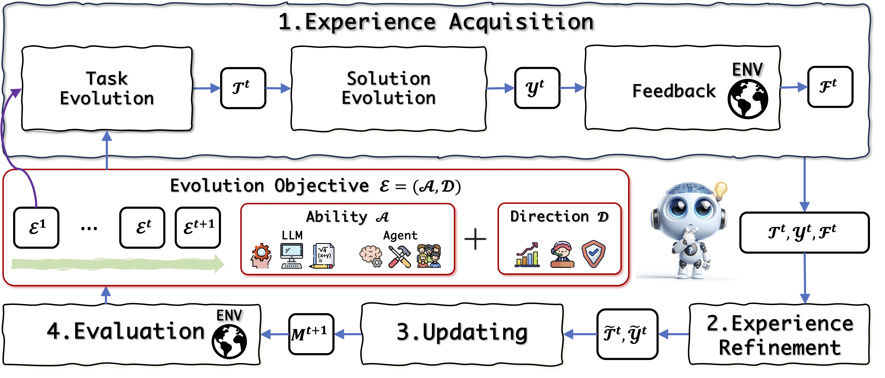

<h1 align="center"> 🤖 Awesome Self-Evolution of Large Language Models  </h1>

This is the reading list for the survey "A Survey on Self-Evolution of Large Language Models" maintained by Alibaba Group, Tongyi Laboratory, Conversation AI. We will keep adding papers and improving the list. Any suggestions and PRs are welcome!

We present a comprehensive survey of self-evolution approaches in LLMs. We first propose a conceptual framework for self-evolution and outline the evolving process as iterative cycles composed of four phases: experience acquisition, experience refinement, updating, and evaluation. 

    

The above is the proposed conceptual framework of self-evolution. For the $t^{th}$ iteration:
- $Ɛ^{t}$: The evolution objective.
- $T^{t}$ and $Y^{t}$: Denote the task and solution, respectively.
- $F^{t}$: Represents feedback.
- $M^{t}$: The current model at iteration $t$.
- $T^{t}$ and $Y^{t}$: Refined experiences (task and solution).
- $M$: The evolved model after incorporating refined experiences.
- $ENV$: The environment in which the entire self-evolution process takes place.

The self-evolution starts at $Ɛ^{1}$ and progresses through iterations, refining and evolving in response to the environment and feedback.

# Experience Acquisition
Experience acquisition or exploration, a strategy of seeking new experiences, is crucial for the self-evolution of LLMs, as it helps them adapt to new tasks, overcome knowledge limitations, and enhance solution effectiveness. We divide experience acquisition into three parts: task evolution, solution evolution, and obtaining feedback.

## Task-Evolution
To gain new experience, the model first evolves new tasks according to the evolution objective $Ɛ^{t}$ in the current iteration. We summarize and categorize existing studies on the task evolution method $f^T$ into three groups: Knowledge-Based, Knowledge-Free, and Selective. 
### Knowledge-Based
- Principle-Driven Self-Alignment of Language Models
from Scratch with Minimal Human Supervision.[[paper](https://proceedings.neurips.cc/paper_files/paper/2023/hash/0764db1151b936aca59249e2c1386101-Abstract-Conference.html)][[code](https://github.com/IBM/Dromedary)]
- Large Language Models are Superpositions of All Characters: Attaining Arbitrary Role-play via Self-Alignment.[[paper](https://arxiv.org/abs/2401.12474)][[code](https://github.com/OFA-Sys/Ditto)]
- Self-seeding and Multi-intent Self-instructing LLMs for Generating Intent-aware Information-Seeking dialogs.[[paper](https://arxiv.org/abs/2402.11633)][[code](https://github.com/arian-askari/solid)]
- Enhancing Chat Language Models by Scaling High-quality Instructional Conversations[[paper](https://arxiv.org/abs/2305.14233)][[code](https://github.com/thunlp/UltraChat)]
- SciGLM: Training Scientific Language Models with Self-Reflective Instruction Annotation and Tuning.[[paper](https://arxiv.org/abs/2401.07950)][[code](https://github.com/THUDM/SciGLM)]

### Knowledge-Free
- Self-Instruct: Aligning Language Models with Self-Generated Instructions.[[paper](https://arxiv.org/abs/2212.10560)][[code](https://github.com/yizhongw/self-instruct)]
- Unnatural Instructions: Tuning Language Models with (Almost) No Human Labor.[[paper](https://arxiv.org/abs/2212.09689)][[code](https://github.com/orhonovich/unnatural-instructions)]
- Code Llama: Open Foundation Models for Code.[[paper](https://arxiv.org/abs/2308.12950)][[code](https://github.com/facebookresearch/codellama)]
- Ada-Instruct: Adapting Instruction Generators for Complex Reasoning.[[paper](https://arxiv.org/abs/2310.04484)][[code](https://github.com/wangitu/Ada-Instruct)]
- WizardLM: Empowering Large Pre-trained Language Models to Follow Complex Instructions.[[paper](https://arxiv.org/abs/2304.12244)][[code](https://github.com/nlpxucan/WizardLM)]
- MetaMath: Bootstrap Your Own Mathematical Questions for Large Language Models.[[paper](https://arxiv.org/abs/2309.12284)][[code](https://meta-math.github.io/)]
- Promptbreeder: Self-referential self-improvement via prompt evolution.[[paper](https://arxiv.org/abs/2309.16797)]
- Self-alignment with Instruction Backtranslation.[[paper](https://arxiv.org/abs/2308.06259)]
- Kun: Answer Polishment for Chinese Self-Alignment With Instruction Back-Translation.[[paper](https://arxiv.org/abs/2401.06477)][[code](https://github.com/Zheng0428/COIG-Kun)]

### Selective
- Self-Evolved Diverse Data Sampling for Efficient Instruction Tuning.[[paper](https://arxiv.org/abs/2311.08182)][[code](https://github.com/OFA-Sys/DiverseEvol.git)]
- Step-On-Feet Tuning: Scaling Self-Alignment of LLMs via Bootstrapping.[[paper](https://arxiv.org/abs/2402.07610)]
- Selective Reflection-Tuning: Student-Selected Data Recycling for LLM Instruction-Tuning.[[paper](https://arxiv.org/abs/2402.10110)][[code](https://github.com/tianyi-lab/Reflection_Tuning)]
- V-star: Training Verifiers for Self-taught Reasoners.[[paper](https://arxiv.org/abs/2402.06457)]

## Solution-Evolution
Solution evolution uses different strategies to solve tasks and enhance LLM capabilities by ensuring that solutions are not just generated but are also relevant and informative. We categorize these methods into positive and negative according to the correctness of the solutions.
### Positive 
#### Rationale-Based
- Large language models can self-improve.[[paper](https://arxiv.org/abs/2210.11610)]
- STAR: Self-Taught Reasoner Bootstrapping Reasoning With Reasoning.[[paper](https://arxiv.org/abs/2203.14465)]
- ReAct Meets ActRe: When Language Agents Enjoy Training Data Autonomy.[[paper](https://arxiv.org/abs/2403.14589)]

#### Interactive
- Self-Evolve: A Code Evolution Framework Via Large Language Models.[[paper](https://arxiv.org/abs/2306.02907)]
- LDB: A Large Language Model Debugger Via Verifying Runtime Execution Step-By-Step.[[paper](https://arxiv.org/pdf/2402.16906)][[code](https://github.com/FloridSleeves/LLMDebugger)]
- Trial and Error: Exploration-based Trajectory Optimization for LLM Agents.[[paper](https://arxiv.org/abs/2403.02502)][[code](https://github.com/Yifan-Song793/ETO)]
- ReAct Meets ActRe: When Language Agents Enjoy Training Data Autonomy.[[paper](https://arxiv.org/abs/2403.14589)]
- AUTOACT: Automatic Agent Learning from Scratch via Self-Planning.[[paper](https://arxiv.org/abs/2401.05268)][[code](https://github.com/zjunlp/AutoAct)]
- Knowa-agent: Knowledge-augmented Planning for LLM-based Agents.[[paper](https://arxiv.org/abs/2403.03101)][[code](https://github.com/zjunlp/KnowAgent)]

#### Self-Play
- Systematic Biases in LLM Simulations of Debates.[[paper](https://arxiv.org/abs/2402.04049)]
- Bootstrapping LLM-Based Task-Oriented Dialogue Agents Via Self-Talk.[[paper](https://arxiv.org/abs/2401.05033)]
- Large Language Models are Superpositions of All Characters: Attaining Arbitrary Role-play via Self-Alignment.[[paper](https://arxiv.org/abs/2401.12474)][[code](https://github.com/OFA-Sys/Ditto)]
- Self-seeding and Multi-intent Self-instructing LLMs for Generating Intent-aware Information-Seeking Dialogs.[[paper](https://arxiv.org/abs/2402.11633)][[code](https://github.com/arian-askari/solid)]
- Sotopia-π: Interactive learning of socially intelligent language agents.[[paper](https://arxiv.org/abs/2403.08715)]

#### Grounded
- Principle-Driven Self-Alignment of Language Models
from Scratch with Minimal Human Supervision.[[paper](https://proceedings.neurips.cc/paper_files/paper/2023/hash/0764db1151b936aca59249e2c1386101-Abstract-Conference.html)][[code](https://github.com/IBM/Dromedary)]
- Salmon: Self-alignment with Principle-following Reward Models.[[paper](https://arxiv.org/abs/2310.05910)][[code](https://github.com/IBM/SALMON)]
- MemoryBank: Enhancing Large Language Models with Long-Term Memory[[paper](https://arxiv.org/abs/2305.10250)][[code](https://github.com/zhongwanjun/MemoryBank-SiliconFriend)]
- Think-in-memory: Recalling and Post-thinking enable LLMs with Long-term Memory.[[paper](https://arxiv.org/abs/2311.08719)]
- Mot: Memory-of-thought enables ChatGPT to Self-improve.[[paper](https://arxiv.org/abs/2305.05181)][[code](https://github.com/LeeSureman/MoT)]
- In-memory Learning: A Declarative Learning Framework for Large Language Models.[[paper](https://arxiv.org/html/2403.02757v1)]
- Failures Pave the Way: Enhancing Large Language Models Through Tuning-Free Rule Accumulation.[[paper](https://arxiv.org/abs/2310.15746)][[code](https://github.com/THUNLP-MT/TRAN)]
- MemGPT: Towards LLMs as Operating Systems.[[paper](https://arxiv.org/abs/2310.08560)][[code](https://research.memgpt.ai/)]

### Negative
#### Contrastive
- Self-rewarding Language Models.[[paper](https://arxiv.org/abs/2401.10020)]
- Self-Play Fine-Tuning Converts Weak Language Models to Strong Language Models.[[paper](https://arxiv.org/abs/2401.01335)][[code](https://github.com/uclaml/SPIN)]
- Grath: Gradual Self-Truthifying for Large Language Models.[[paper](https://arxiv.org/abs/2401.12292)]
- Self-Contrast: Better Reflection Through Inconsistent Solving Perspectives.[[paper](https://arxiv.org/abs/2401.02009)]
- Trial and Error: Exploration-Based Trajectory Optimization for LLM Agents.[[paper](https://arxiv.org/abs/2403.02502)][[code](https://github.com/Yifan-Song793/ETO)]
- ReAct Meets ActRe: When Language Agents Enjoy Training Data Autonomy.[[paper](https://arxiv.org/abs/2403.14589)]
- LLMs in the Imaginarium: Tool Learning through Simulated Trial and Error.[[paper](https://arxiv.org/abs/2403.04746)][[code](https://github.com/microsoft/simulated-trial-and-error)]
- Can LLMs Learn from Previous Mistakes? Investigating LLMs’ Errors to Boost for Reasoning.[[paper](https://arxiv.org/abs/2403.20046)]

#### Perturbative
- RLCD: Reinforcement Learning from Contrastive Distillation for LM Alignment.[[paper](https://arxiv.org/abs/2307.12950)][[code](https://github.com/facebookresearch/rlcd)]
- Direct Large Language Model Alignment through Self-rewarding Contrastive Prompt Distillation.[[paper](https://arxiv.org/abs/2402.11907)]
- Large Language Models are Superpositions of All Characters: Attaining Arbitrary Role-play via Self-Alignment.[[paper](https://arxiv.org/abs/2401.12474)][[code](https://github.com/OFA-Sys/Ditto)]

## Feedback
Feedback plays a critical role in demonstrating the correctness of the solutions. LLMs could obtain feedback during or after the task solution in the cycle of self-evolution optionally. We summarize two types of feedback: model-based and environment-based.

### Model
- Self-rewarding Language Models.[[paper](https://arxiv.org/abs/2401.10020)]
- Learning by Self-explaining.[[paper](https://arxiv.org/abs/2309.08395)][[code](https://github.com/ml-research/learning-by-self-explaining.git)]
- Direct Large Language model Alignment through Self-rewarding Contrastive Prompt Distillation.[[paper](https://arxiv.org/abs/2402.11907)]
- Language model Self-improvement by Reinforcement Learning Contemplation.[[paper](https://arxiv.org/abs/2305.14483)]
- Self-Alignment for Factuality: Mitigating Hallucinations in LLMs via Self-Evaluation[[paper](https://arxiv.org/abs/2402.09267)][[code](https://github.com/zhangxy-2019/Self-Alignment-for-Factuality)]
- Constitutional AI: Harmlessness from AI Feedback.[[paper](https://arxiv.org/abs/2212.08073)][[code](https://github.com/anthropics/ConstitutionalHarmlessnessPaper?tab=readme-ov-file)]
- SELF-REFINE:Iterative Refinement with Self-Feedback[[paper](https://arxiv.org/pdf/2303.17651.pdf)][[code](https://selfrefine.info/)]

### Environment
- Self-evolve: A code evolution framework via large language models.[[paper](https://arxiv.org/abs/2306.02907)]
- Teaching Large Language Models to Self-debug.[[paper](https://arxiv.org/abs/2304.05128)]
- Reflexion: an Autonomous Agent with Dynamic Memory and Self-reflection.[[paper](https://arxiv.org/abs/2303.11366)][[code](https://github.com/noahshinn024/reflexion)]
- Critic: Large language Models can Self-correct with Tool-interactive Critiquing.[[paper](https://arxiv.org/abs/2305.11738)][[code](https://github.com/microsoft/ProphetNet/tree/master/CRITIC)]
- Robocat: A Self-improving Generalist Agent for Robotic Manipulation.[[paper](https://arxiv.org/abs/2306.11706)]
- SInViG: A Self-evolving Interactive Visual Agent for Human-robot Interaction.[[paper](https://arxiv.org/abs/2402.11792)]

# Experience Refinement
LLMs may improve the quality and reliability of their outputs through experience refinement. It helps LLMs adapt to new information and contexts without relying on external resources, leading to more reliable and effective assistance in dynamic environments. We classify the methods into two categories: filtering and correcting.
## Filtering
### Metric-Based
- Beyond Human Data: Scaling Self-training for Problem-solving with Language Models.[[paper](https://arxiv.org/abs/2312.06585)][[code]()]
- AUTOACT: Automatic Agent Learning from Scratch via Self-Planning.[[paper](https://arxiv.org/abs/2401.05268)][[code](https://github.com/zjunlp/AutoAct)]
- Bootstrapping LLM-based Task-oriented Dialogue Agents via Self-talk.[[paper](https://arxiv.org/abs/2401.05033)]
- Self-Instruct: Aligning Language Models with Self-Generated Instructions.[[paper](https://arxiv.org/abs/2212.10560)][[code](https://github.com/yizhongw/self-instruct)]

### Metric-Free
- Self-Consistency Improves Chain of Thought Reasoning in Language Models.[[paper](https://arxiv.org/abs/2203.11171)]
- Language Model Self-improvement by Reinforcement Learning Contemplation.[[paper](https://arxiv.org/abs/2305.14483)]
- Large Language Models are Better Reasoners with Self-Verification[[paper](https://arxiv.org/abs/2212.09561)][[code](https://github.com/WENGSYX/Self-Verification)]
- Codet: Code Generation with Generated Tests.[[paper](https://arxiv.org/abs/2207.10397)][[code](https://github.com/microsoft/CodeT)]

## Correcting
### Critique-Based
- SELF-REFINE:Iterative Refinement with Self-Feedback[[paper](https://arxiv.org/pdf/2303.17651.pdf)][[code](https://selfrefine.info/)]
- Constitutional AI: Harmlessness from AI Feedback.[[paper](https://arxiv.org/abs/2212.08073)][[code](https://github.com/anthropics/ConstitutionalHarmlessnessPaper?tab=readme-ov-file)]
- Language Models can Solve Computer Tasks.[[paper](https://arxiv.org/abs/2303.17491)][[code](https://github.com/posgnu/rci-agent)]
- Critic: Large Language Models can Self-correct with Tool-interactive Critiquing.[[paper](https://arxiv.org/abs/2305.11738)][[code](https://github.com/microsoft/ProphetNet/tree/master/CRITIC)]
- Self-Evolve: A Code Evolution Framework via Large Language Models.[[paper](https://arxiv.org/abs/2306.02907)]
- ISR-LLM: Iterative Self-Refined Large Language Model for Long-Horizon Sequential Task Planning.[[paper](https://arxiv.org/abs/2308.13724)][[code](https://github.com/zhehuazhou/ISR-LLM)]

### Critique-Free
- Star: Self-taught Reasoner Bootstrapping Reasoning with Reasoning.[[paper](https://arxiv.org/abs/2203.14465)]
- Teaching Large Language Models to Self-Debug.[[paper](https://arxiv.org/abs/2304.05128)]
- Iterative Translation Refinement with Large Language Models[[paper](https://arxiv.org/abs/2306.03856)]
- Self-Verification Improves Few-Shot Clinical Information Extraction.[[paper](https://arxiv.org/abs/2306.00024)][[code](https://github.com/microsoft/clinical-self-verification)]

# Updating
During updating, LLMs leverage the refined experiences to improve model performance. We divide these approaches into in-weight learning, which involves updates to model weights, and in-context learning, which involves updates to external or working memory.
## In-Weight
### Replay
- Scaling Relationship on Learning Mathematical Reasoning with Large Language Models.[[paper](https://arxiv.org/abs/2308.01825)][[code](https://github.com/OFA-Sys/gsm8k-ScRel)]
- Reinforced Self-Training (ReST) for Language Modeling.[[paper](https://arxiv.org/abs/2308.08998)]
- ReST meets ReAct: Self-Improvement for Multi-Step Reasoning LLM Agent.[[paper](https://arxiv.org/abs/2312.10003)]
- Towards Conversational Diagnostic AI.[[paper](https://arxiv.org/abs/2401.05654)]
- Sotopia-π: Interactive Learning of Socially Intelligent Language Agents.[[paper](https://arxiv.org/abs/2403.08715)]
- LLM2LLM: Boosting LLMs with Novel Iterative Data Enhancement[[paper](https://arxiv.org/abs/2403.15042)][[code](https://github.com/SqueezeAILab/LLM2LLM)]
- Adapting LLM Agents with Universal Feedback in Communication.[[paper](https://arxiv.org/abs/2310.01444)][[code]()]
- ReAct Meets ActRe: When Language Agents Enjoy Training Data Autonomy.[[paper](https://arxiv.org/abs/2403.14589)]
- Mitigating Catastrophic Forgetting in Large Language Models with Self-Synthesized Rehearsal.[[paper](https://arxiv.org/abs/2403.01244)]
- Self-Distillation Bridges Distribution Gap in Language Model Fine-Tuning.[[paper](https://arxiv.org/abs/2402.13669)][[code](https://github.com/sail-sg/sdft)]

### Regularization
- Training language Models to Follow Instructions with Human Feedback.[[paper](https://arxiv.org/abs/2203.02155)]
- Knowledge Fusion of Large Language Models.[[paper](https://arxiv.org/abs/2401.10491)][[code](https://github.com/fanqiwan/FuseLLM)]
- Language Model Alignment with Elastic Reset.[[paper](https://arxiv.org/abs/2312.07551)][[code](https://github.com/mnoukhov/elastic-reset)]
- WARM: On the Benefits of Weight Averaged Reward Models.[[paper](https://arxiv.org/abs/2401.12187)]
- Mitigating the Alignment Tax of RLHF.[[paper](https://arxiv.org/abs/2309.06256)]
    
### Architecture
- LoRA: Low-Rank Adaptation of Large Language Models.[[paper](https://arxiv.org/abs/2106.09685)][[code](https://github.com/microsoft/LoRA)]
- ConPET: Continual Parameter-Efficient Tuning for Large Language Models.[[paper](https://arxiv.org/abs/2309.14763)][[code](https://github.com/Raincleared-Song/ConPET)]
- Model Soups: Averaging Weights of Multiple Fine-tuned Models Improves Accuracy without Increasing Inference Time[[paper](https://arxiv.org/abs/2203.05482)][[code](https://github.com/mlfoundations/model-soups)]
- Language Models are Super Mario: Absorbing Abilities from Homologous Models as a Free Lunch.[[paper](https://arxiv.org/abs/2311.03099)][[code](https://github.com/yule-BUAA/MergeLM)]
- Mastering Text, Code and Math Simultaneously via Fusing Highly Specialized Language Models.[[paper](https://arxiv.org/abs/2403.08281)]
- Evolutionary Optimization of Model Merging Recipes.[[paper](https://arxiv.org/abs/2403.13187)][[code](https://github.com/SakanaAI/evolutionary-model-merge)]

## In-Context
### External Memory
- MoT: Memory-of-Rhought Enables ChatGPT to Self-improve.[[paper](https://arxiv.org/abs/2305.05181)][[code](https://github.com/LeeSureman/MoT)]
- Failures Pave the Way: Enhancing Large Language Models through Tuning-free Rule Accumulation.[[paper](https://arxiv.org/abs/2310.15746)][[code](https://github.com/THUNLP-MT/TRAN)]
- MemoryBank: Enhancing Large Language Models with Long-Term Memory[[paper](https://arxiv.org/abs/2305.10250)][[code](https://github.com/zhongwanjun/MemoryBank-SiliconFriend)]
- Think-in-memory: Recalling and Post-thinking Enable LLMs with Long-term memory.[[paper](https://arxiv.org/abs/2311.08719)]
- In-memory Learning: A Declarative Learning Framework for Large Language Models.[[paper](https://arxiv.org/html/2403.02757v1)]
- MemGPT: Towards LLMa as Operating Systems.[[paper](https://arxiv.org/abs/2310.08560)][[code](https://research.memgpt.ai/)]
- Towards Unified Alignment Between Agents, Humans, and Environment.[[paper](https://arxiv.org/abs/2402.07744)][[code](https://agent-force.github.io/unified-alignment-for-agents.html)]
- Investigate-Consolidate-Exploit: A General Strategy for Inter-Task Agent Self-Evolution.[[paper](https://arxiv.org/abs/2401.13996)]
- AesopAgent: Agent-driven Evolutionary System on Story-to-Video Production.[[paper](https://arxiv.org/abs/2403.07952)][[code](https://aesopai.github.io/)]

### Working Memory
- Reflexion: Language Agents with Verbal Reinforcement Learning.[[paper](https://arxiv.org/abs/2303.11366)][[code](https://github.com/noahshinn024/reflexion)]
- In-memory Learning: A Declarative Learning Framework for Large Language Models.[[paper](https://arxiv.org/html/2403.02757v1)]
- Agent Alignment in Evolving Social Norms.[[paper](https://arxiv.org/abs/2401.04620)]
- Agent-Pro: Learning to Evolve via Policy-Level Reflection and Optimization.[[paper](https://arxiv.org/abs/2402.17574)][[code](https://github.com/zwq2018/Agent-Pro)]
- ProAgent: Building Proactive Cooperative Agents with Large Language Models.[[paper](https://arxiv.org/abs/2308.11339)][[code](https://pku-proagent/)]

# Evaluation
The evaluation process for an evolved model $M^t$ involves a function $f^E$ that assesses its current performance and sets future goals by producing a performance score $S^{t+1}$ and evolving objectives $E^{t+1}$ based on the model's current state and its environment. We categorize evaluation function into quantitative and qualitative approaches.
## Quantitative
- Judging LLM-as-a-Judge with MT-Bench and Chatbot Arena.[[paper](https://arxiv.org/abs/2306.05685)][[code](https://github.com/lm-sys/FastChat/tree/main/fastchat/llm_judge)]
- AlpacaFarm: A Simulation Framework for Methods that Learn from Human Feedback.[[paper](https://arxiv.org/abs/2305.14387)][[code](https://github.com/tatsu-lab/alpaca_farm)]

## Qualitative
- Failures pave the way: Enhancing large language models through tuning-free rule accumulation.[[paper](https://arxiv.org/abs/2310.15746)][[code](https://github.com/THUNLP-MT/TRAN)]
- ChatEval: Towards Better LLM-based Evaluators through Multi-Agent Debate.[[paper](https://arxiv.org/abs/2308.07201)][[code](https://github.com/chanchimin/ChatEval)]

