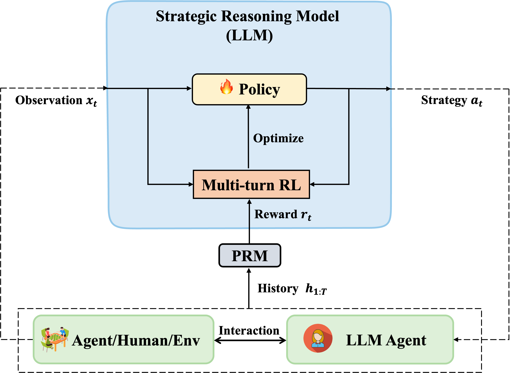

# Explicit Policy Optimization for Strategic Reasoning in LLMs via Reinforcement Learning

Official codebase for [EPO: Explicit Policy Optimization for Strategic Reasoning in LLMs via Reinforcement Learning](https://arxiv.org/abs/2502.12486)

We introduce **EPO**, an explicit policy optimization method for advancing strategic reasoning in LLMs, where an RL-driven reasoning model can be plugged into arbitrary LLM agents to incentivize goal-directed behavior in dynamic environments.


## Method



## Getting Started

Currently, we provide the following code of EPO, you can find more details in each directory.

- LLaMA-Factory: Training and inference scripts for EPO.
- Sotopia: Test environment for SOTOPIA.
- Alfshop: Test environment for WebShop and ALFWorld.

### Setup
```bash
conda create -n epo python==3.10
conda activate epo
git clone hhttps://github.com/AlibabaResearch/DAMO-ConvAI.git
cd EPO
```
Then install the dependencies for training and evaluation, respectively. Please follow the instructions in the README in each directory.

### Training Data

You can collect training data for EPO according to the README in `LLaMA-Factory`, or directly download our RL training data from [huggingface](https://huggingface.co/datasets/Tongyi-ConvAI/EPO-RL-data).

### Training
```bash
cd LlaMA-Factory
# train on SOTOPIA-PI
llamafactory-cli train examples/train_epo/llama3_sotopia_pi_rl.yaml
# train on WebShop and ALFWorld
llamafactory-cli train examples/train_epo/llama3_alfshop_rl.yaml
```

### Evaluation
```bash
# Evaluate on SOTOPIA
cd Sotopia
sotopia benchmark --models <TEST_MODEL_NAME> --partner-model <PARTNER_MODEL-NAME>  --evaluator-model gpt-4o --strategy-model <REASON_MODEL_NAME> --strategy-model-partner <REASON_MODEL_NAME> --batch-size <BATCH_SIZE> --task all --trial-id <TRIAL_NUMBER>
```
```bash
# Evaluate on WebShop or ALFWorld
cd Alfshop
python -m fastchat.serve.controller
python -m fastchat.serve.model_worker --model-path <YOUR_MODEL_PATH> --port 21002 --worker-address http://localhost:21002 # You can edit the port number
python -m eval_agent.main --thought_agent_config fastchat --thought_model_name <REASON_MODEL_NAME> --action_agent_config openai --action_model_name <ACTION_MODEL_NAME> --exp_config <TASK_NAME> --split test --verbose
```


## Citation

Please cite our paper as:

```bash
@article{liu2025epo,
  title={EPO: Explicit Policy Optimization for Strategic Reasoning in LLMs via Reinforcement Learning},
  author={Liu, Xiaoqian and Wang, Ke and Li, Yongbin and Wu, Yuchuan and Ma, Wentao and Kong, Aobo and Huang, Fei and Jiao, Jianbin and Zhang, Junge},
  journal={arXiv preprint arXiv:2502.12486},
  year={2025}
}
``` 