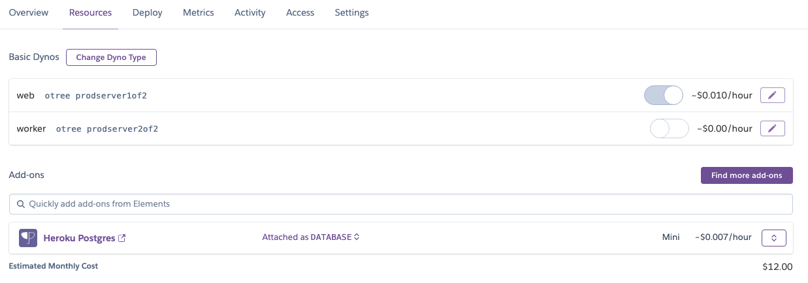
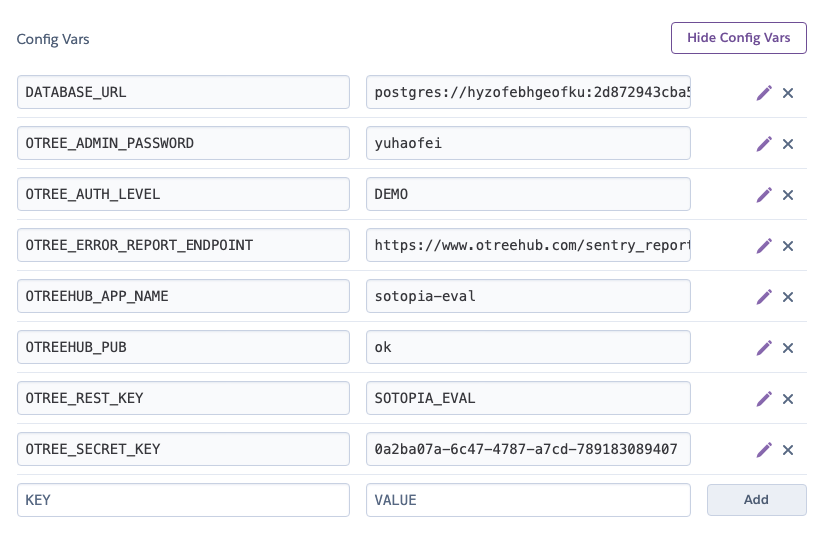
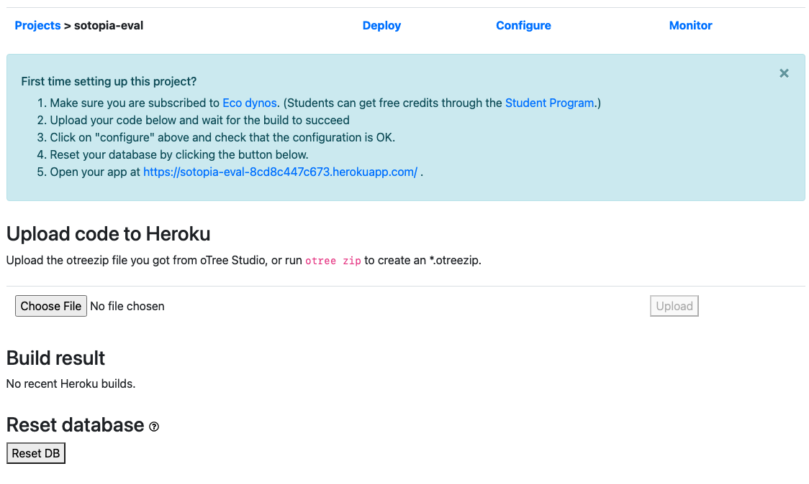
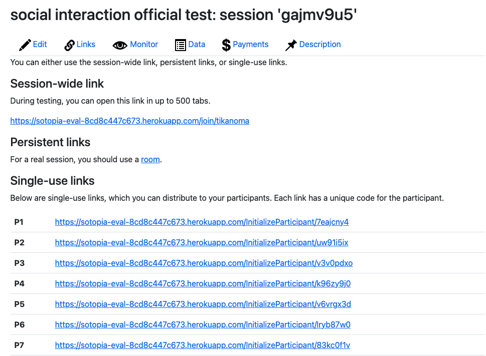
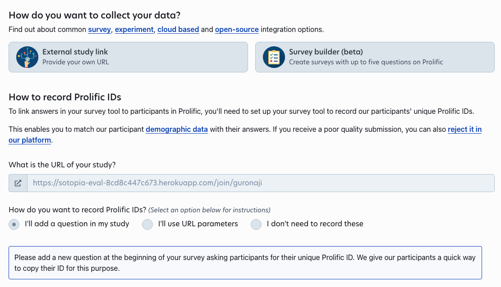

# Human Evaluation for Sotopia

To conduct highly customized human evaluation experiments for Sotopia and Sotopia-$\pi$ multi-turn social conversation, we utilize **Prolific** platform to get high-quality annotators and utilize **oTree** to build the full-stack evaluation system.

## Table of Content

- [File Structure](#file-structure)
- [Local Development](#local-development)
- [Project Deployment](#project-deployment)
- [Annotator Agreement](#annotator-agreement)

## File Structure

The overall structure of this provided human evaluation system includes two parts: `pilot_study` and `official_study`. For `pilot_study`, it is used to select qualified annotators from the prolific. For `official_study`, it is used to get the final human evaluation results based on qualified annotators.

The important files for the otree project is described as:

```
human_eval/
├─ official_study/ # Consolidates all related official study materials
│  ├─ payment_info/ # Dedicated sub-directory for payment information
│  │  ├─ __init__.py # Contains payment information logic
│  │  └─ PaymentInfo.html # HTML page for payment information
│  ├─ annotator_instructions/ # Contains instructions for annotators
│  │  └─ SotopiaEvalInstruction.html # Instruction page for the Sotopia evaluation
│  └─ annotator_interface/ # Contains the interface for annotator tasks
│     ├─ __init__.py # Data point distribution and processing logic
│     └─ SotopiaEval.html # Page for annotators to fill in answers
│
├─ pilot_study/ # Similar structure with the official study
│  ├─ payment_info/
│  │  ├─ __init__.py
│  │  └─ PaymentInfo.html
│  ├─ annotator_instructions/
│  │  └─ SotopiaEvalInstruction.html
│  └─ annotator_interface/
│     ├─ __init__.py
│     └─ SotopiaEval.html
│
└─ other
```

## Local Development

We can locally launch our otree project based on the following command:

```bash
pip install -r requirements.txt
otree devserver
```

After this operation, we can visit the website via https://localhost:8000 for debugging.

## Project Deployment

#### Step1. Create Apps on Heruko

**Step1.1**

First, we need to create a Heruko apps as our base app to deploy.

**Step1.2**

Secondly, we need to link our apps with Heroku Postgres.



**Step1.3**

Thirdly, we need to change the environment config var under setting to support release of our evaluation task including avoiding debugging information and admin login.



#### Step2. Deploy oTree project via oTree Hub

**Step2.1**

After finishing modifying the otree project, we can run `otree zip` to have a `otree_project.otreezip` for deployment.

**Step2.2**

Secondly, this zip file is used to deploy on oTree Hub. Each oTree Hub should be linked with one or more Heruko apps so that we can directly deploy based on that. (https://www.otreehub.com/my_projects/). More instructions about how to use otree-hub can be found at https://otree.readthedocs.io/en/latest/server/heroku.html.



**Step2.3**

Thirdly, after deploying on oTree Hub, we need to reset our database to make sure our database is empty (which is optional but recommended).

**Step2.4**

Finally, we can get a deployment link similar with https://sotopia-eval-8cd8c447c673.herokuapp.com/demo that is deployed on Heruko server.

#### Step3. Release on Prolific

**Step3.1**

To release on Prolific, we need to get a release link that annotators can directly access to. To get this release link, we need to click into the deployment link and create new sessions with sufficient participants. Therefore, we can get a session-wide link that is used for annotators like https://sotopia-eval-8cd8c447c673.herokuapp.com/join/tikanoma.



**Step3.2**

Secondly, we just put the release link into the Prolific project setting.



## Annotator Agreement

Based on the annotation results, we support scripts in `agreement.py` to calculate inter-annotator agreement for unpaired multi-annotator annotation. This script supports agreement computation based on artifical data for unpaired data annotation with multiple annotator.

In our data annotation case, the annotation are:

```
data1 annotated by A,B
data2 annotated by C,D
data3 annotated by A,D
data4 annotated by B,E
```

We support three agreement metrics for such unpaired multi-annotator annotation:

1. Pairwise agreement

   Pairwise agreement is a straightforward method used to evaluate the level of agreement or consensus among two or more raters (or systems, observers, etc.) when they classify, rate, or make decisions about the same set of items. It is often used in contexts where inter-rater reliability or consensus is important, such as content analysis, medical diagnosis, or any field requiring subjective judgments.

2. Krippendorf's alpha

   Krippendorff's Alpha is a statistical measure designed to assess the reliability of data when multiple raters evaluate a set of items. It is applicable across different levels of measurement scales (nominal, ordinal, interval, and ratio) and can handle missing data, making it versatile across various research contexts. Krippendorff's Alpha can evaluate the agreement among any number of raters and is not limited to two.

3. Randolph's kappa

   Randolph's Kappa, also known as free-marginal kappa, is a statistical measure used to assess the agreement between raters when categorizing items into mutually exclusive categories. It is a variant of Cohen's Kappa, which is another measure of inter-rater reliability. The key difference between Randolph's Kappa and traditional kappa measures is that Randolph's Kappa does not assume a fixed distribution of ratings across categories (i.e., the marginals are free or not predetermined).

4. Fleiss's kappa

   Fleiss' Kappa is an extension of Cohen's Kappa for situations involving three or more raters. It assesses the reliability of agreement among a fixed number of raters when assigning categorical ratings to a number of items. Like Cohen's Kappa, it also accounts for agreement occurring by chance.
