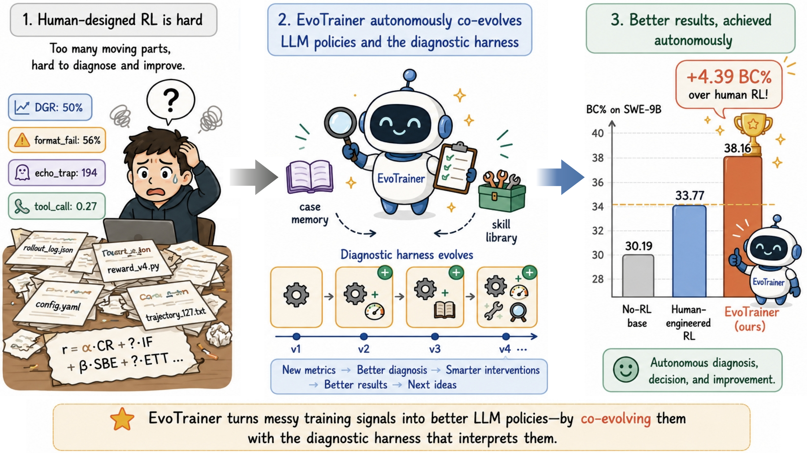
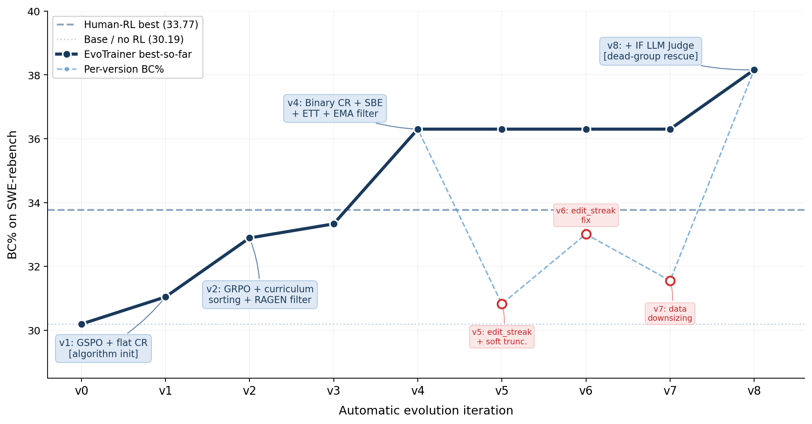
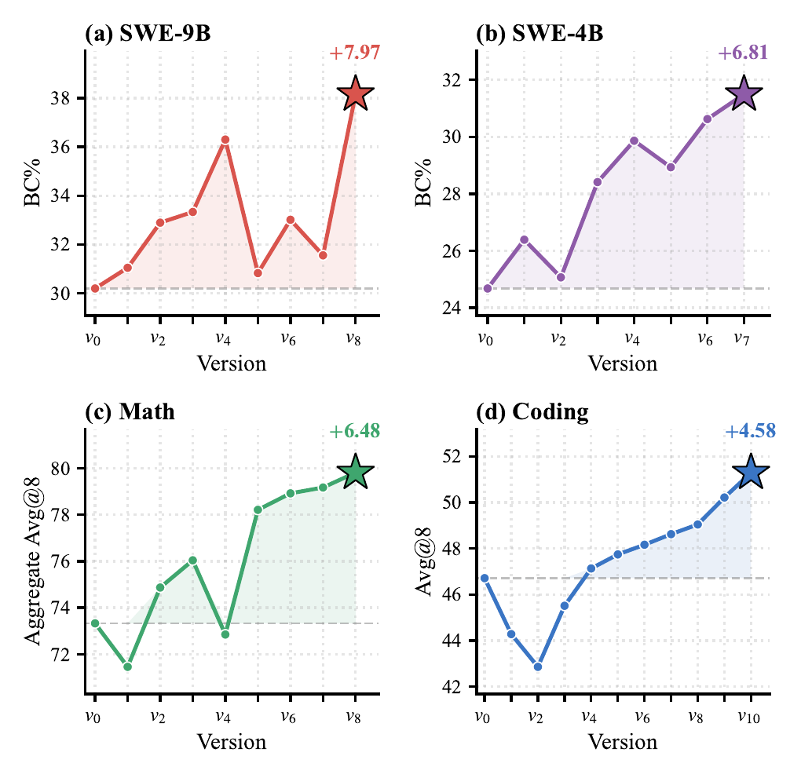

# EvoTrainer: 协同进化 LLM 策略与训练诊断框架的自主 Agentic 强化学习

[[论文]](https://arxiv.org/abs/2606.03108) | [English](README.md) | 中文

EvoTrainer 是一个自主训练框架，通过经验反馈协同进化 LLM 策略和训练侧诊断框架。它能够诊断 rollout 级别的证据、修订诊断逻辑、回测干预措施并积累可复用技能。

基于 [ROLL](https://github.com/alibaba/ROLL)（Reinforcement Learning Optimization for Large-Scale Learning）框架构建。

<p align="center">
  
</p>

## 主要结果

| 领域 | 基线（无 RL） | 人工设计的 RL | EvoTrainer |
|------|:---:|:---:|:---:|
| SWE-9B (BC%) | 30.19 | 33.77 | **38.16** (+7.97) |
| SWE-4B (BC%) | 24.68 | 31.17 | **31.49** (+6.81) |
| Math AIME 2024 (Avg@8) | 77.50 | 80.83 | **84.17** (+6.67) |
| Math AIME 2025 (Avg@8) | 67.50 | 71.67 | **73.33** (+5.83) |
| Math CNMO 2024 (Avg@8) | 75.00 | 77.78 | **81.94** (+6.94) |
| Coding (Avg@8) | 46.71 | 50.71 | **51.29** (+4.58) |

## 数据集

### 训练数据

| 领域 | 数据集 | 规模 | 来源 |
|------|--------|------|------|
| 数学 | Big-Math-RL-Verified | 6,429 题 | [HuggingFace: SynthLabsAI/Big-Math-RL-Verified](https://huggingface.co/datasets/SynthLabsAI/Big-Math-RL-Verified) |
| 编程 | TACO-verified | 11,897 题 | [HuggingFace: BAAI/TACO](https://huggingface.co/datasets/BAAI/TACO) |
| SWE | swe-rebench-v6（训练集） | 8,622 实例 | [HuggingFace: nebius/SWE-rebench](https://huggingface.co/datasets/nebius/SWE-rebench) |

### 评测数据

| 领域 | 基准 | 规模 | 来源 |
|------|------|------|------|
| 数学 | AIME 2024 | 30 题 | [HuggingFace: math-ai/aime24](https://huggingface.co/datasets/math-ai/aime24) |
| 数学 | AIME 2025 | 30 题 | [HuggingFace: math-ai/aime25](https://huggingface.co/datasets/math-ai/aime25) |
| 数学 | CNMO 2024 | 18 题 | 2024 全国数学奥林匹克竞赛 |
| 编程 | LiveCodeBench-v6（AtCoder 子集） | 175 题 | [GitHub: LiveCodeBench](https://github.com/livecodebench/livecodebench) |
| SWE | swe-rebench-v6（测试集） | 77 实例（Python） | [HuggingFace: nebius/SWE-rebench](https://huggingface.co/datasets/nebius/SWE-rebench) |

### 数据格式

训练数据使用 JSONL 格式，每行一个 JSON 对象，包含以下字段：

**数学 / 编程：**
```json
{
  "messages": [{"role": "user", "content": "..."}],
  "domain": "math_rule" | "code_sandbox",
  "tag": "<dataset_tag>"
}
```

**SWE（Agentic）：**
```json
{
  "meta": {
    "instance_id": "repo__issue_id",
    "messages": [{"role": "user", "content": "<problem_statement>"}],
    "repo": "owner/repo",
    "base_commit": "<commit_hash>"
  }
}
```

## 评测协议

- 所有领域使用 **Avg@8**（每个问题 8 次独立 rollout 取平均），种子为 42。
- **数学**：由冻结的 Qwen3.5-4B 模型作为 LLM Judge 判定正确性。
- **编程**：通过 stdin/stdout 对比测试用例判定正确性。
- **SWE**：BC%（Binary Correctness），通过隐藏的 fail-to-pass 单元测试判定。

## 安装

```bash
pip install -e .
pip install -r requirements_common.txt

# 选择一个推理后端：
pip install -r requirements_torch280_vllm.txt   # vLLM 后端
# 或
pip install -r requirements_torch280_sglang.txt  # SGLang 后端
```

## 快速开始

### 1. 准备模型和数据

```bash
# 设置环境变量
export MODEL_PATH=/path/to/your/base/model        # 例如 Qwen3.5-4B 或 Qwen3.5-9B
export DATA_DIR=/path/to/your/data                 # 存放训练 JSONL 文件的目录
export OUTPUT_DIR=/path/to/output                  # 训练输出目录
```

### 2. 启动 Agentic 训练

```bash
python examples/start_agentic_pipeline.py --config_path examples/qwen35-4b-agentic/train_swe_v1.yaml
```

### 3. 配置说明

训练配置文件位于 `examples/qwen35-{4b,9b}-agentic/`，关键参数：

| 参数 | 说明 | 默认值 |
|------|------|--------|
| `rollout_batch_size` | 每批生成的 prompt 数量 | 32 |
| `sequence_length` | 最大序列长度 | 131072 |
| `ppo_epochs` | PPO 更新轮数 | 1 |
| `adv_estimator` | 优势估计方式（grpo/gae） | grpo |
| `pg_clip` / `pg_clip_high` | Clip-Higher 裁剪范围 | 0.2 / 0.27 |
| `reward_clip` | 奖励裁剪阈值 | 2 |
| `custom_envs.*.env_config.max_steps` | Agent 最大交互轮数 | 100 |

## 复现 SWE-9B v8

发布的配置 `examples/qwen35-9b-agentic/train_swe_v1.yaml` 提供了 v1 基线。要复现 v8（最佳 SWE 版本，BC%=38.16），需对 `roll/pipeline/agentic/env/qwen_mcp_swe/env.py` 和训练 yaml 做以下修改：

### 1. Reward：添加指令遵循 LLM Judge

在 `env.py` 中，计算完 `correctness_reward` 后添加 IF 评分：

```python
# v8: Instruction-Following LLM Judge
if self.config.enable_instruction_following:
    if_score = await self.instruction_following_judge(trajectory)  # 返回 [0.0, 1.0]
    final_reward = correctness_reward * 1.0 + if_score * 0.1 + sbe_reward + ett_reward
```

在 `config.py` 中添加：
```python
enable_instruction_following: bool = True
instruction_following_model: str = "/path/to/reward_model"  # 如 Qwen3.5-27B
```

### 2. Reward：添加 SBE（先搜索再编辑）和 ETT（编辑后测试）

在 `env.py` 中实现行为奖励信号：

```python
# SBE: 如果 agent 在首次编辑前执行了搜索，+0.1
sbe_reward = 0.1 if first_search_turn < first_edit_turn else 0.0

# ETT: 如果 agent 在编辑后运行了测试，+0.15
ett_reward = 0.15 if has_test_after_last_edit else 0.0
```

### 3. 过滤：StdGroupFilter + EMA 阈值

在训练 yaml 的 `train_env_manager` 下添加：

```yaml
train_env_manager:
  group_filter_mode: "std"
  group_keep_ratio: 0.9
  group_ema_decay: 0.95
  group_min_std_threshold: 1e-6
```

### 4. 训练配置变更（yaml）

```yaml
# v1 → v8 的关键差异：
exp_name: "train_qwen35_9b_v8"
custom_envs:
  qwen_mcp_swe_rebench:
    env_config:
      enable_instruction_following: true
      instruction_following_model: /path/to/Qwen3.5-27B
      reward_coefficients:
        correctness: 1.0
        instruction_following: 0.1
        search_before_edit: 0.1
        edit_then_test: 0.15
```

完整 v8 配置参见 `examples/qwen35-9b-agentic/train_swe_v8.yaml`。

## 项目结构

```
├── roll/
│   ├── pipeline/
│   │   ├── agentic/           # Agentic RL 流水线（本工作核心）
│   │   │   ├── env/           # 环境实现（SWE、数学、编程）
│   │   │   ├── env_manager/   # 环境管理与编排
│   │   │   ├── llm_proxy/     # LLM 推理代理
│   │   │   └── tools/         # 工具实现（MCP、代码执行）
│   │   ├── rlvr/              # RLVR 流水线（来自 ROLL）
│   │   ├── dpo/               # DPO 流水线（来自 ROLL）
│   │   ├── distill/           # 蒸馏流水线（来自 ROLL）
│   │   └── sft/               # SFT 流水线（来自 ROLL）
│   ├── distributed/           # 分布式训练基础设施（来自 ROLL）
│   ├── configs/               # 配置系统
│   ├── datasets/              # 数据加载与采样
│   ├── models/                # 模型提供者
│   ├── third_party/           # 后端适配器（vLLM、SGLang、Megatron、DeepSpeed）
│   └── utils/                 # 工具函数
├── examples/                  # 训练配置和启动脚本
├── skills/                    # EvoTrainer 技能库与分析手册
├── docker/                    # Docker 环境配置
├── mcore_adapter/             # Megatron-Core 模型适配器
└── data/                      # 数据模板和样例
```

## 案例：SWE-9B 迭代过程

<p align="center">
  
</p>

关于 EvoTrainer 如何诊断瓶颈、设计干预并从 v1 (31%) 演进到 v8 (38%) 的完整过程，请参阅[论文](https://arxiv.org/abs/2606.03108) §5 或本仓库中的 `skills/ANALYSIS_PLAYBOOK.md` 和 `skills/domain/swe/training_9b.md`。

## 跨域版本演进轨迹

<p align="center">
  
</p>

EvoTrainer 针对不同领域的特定瓶颈自适应进化，而非套用单一通用方案：

- **SWE** 演化方向：行为敏感的 reward 设计（SBE、ETT）+ 指令遵循 Judge 解救死组
- **Math** 演化方向：reward 改进饱和后引入计算增强工具（Code Interpreter）
- **Coding** 演化方向：执行对齐的 reward shaping（shaped CR）+ 跨域技能复用（从 SWE 迁移 StdGroupFilter）

*各领域保留的策略显著分化，反映了不同的瓶颈结构，而非单一固定的 RL 模板。*

## 引用

```bibtex
@article{chen2026evotrainer,
  title={EvoTrainer: Co-Evolving LLM Policies and Training Harnesses for Autonomous Agentic Reinforcement Learning},
  author={Chen, Guhong and Shi, Yingcheng and Li, Yongbin and Li, Binhua and Xu, Xander and Wei, Hu and Ni, Shiwen and Yang, Min and Ye, Jieping},
  journal={arXiv preprint arXiv:2606.03108},
  year={2026}
}
```

## 致谢

本项目基于 [ROLL](https://github.com/alibaba/ROLL) 框架构建，感谢 ROLL 团队提供的分布式 RL 训练基础设施。

> **说明**：本仓库中部分 prompt 模板、工具 schema 及 SWE 任务脚手架因合规要求已做脱敏处理。所有代码和数据均经过外部披露合规审查。如本仓库内容与论文发表结果存在差异，请以[论文](https://arxiv.org/abs/2606.03108)为准。

## 许可证

Apache License 2.0
