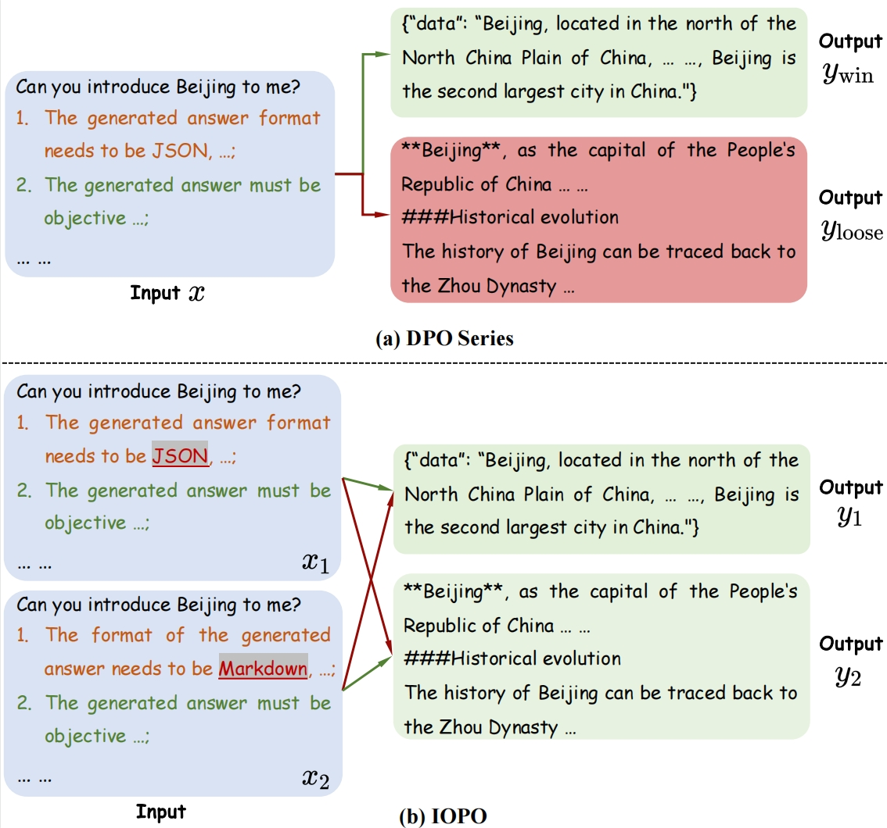
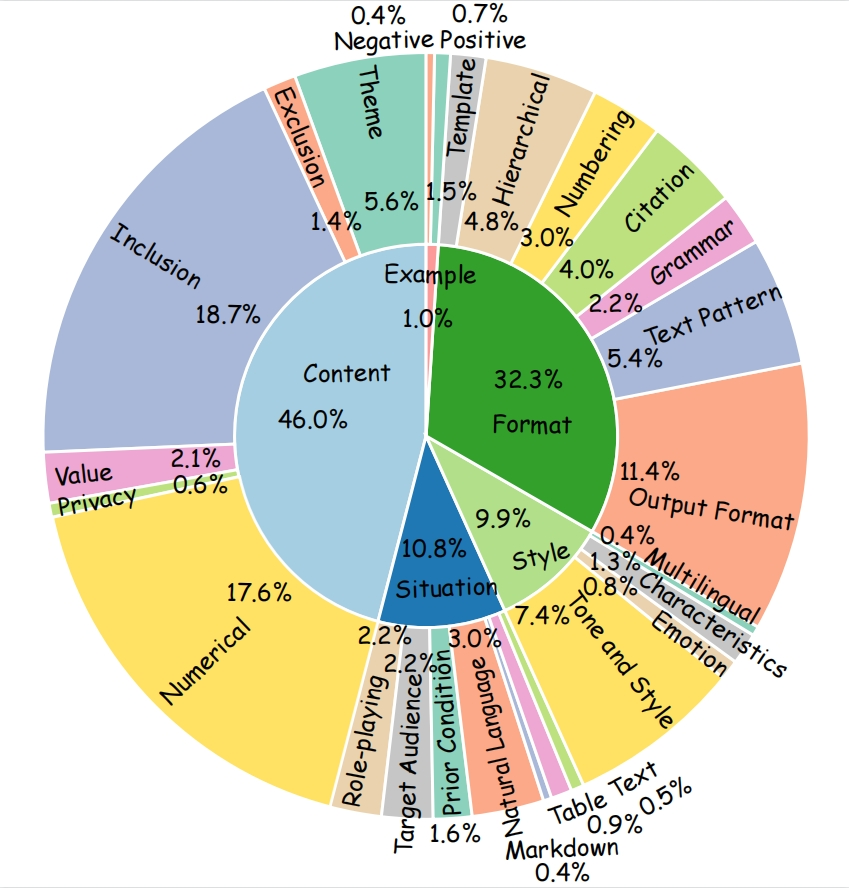

# IOPO: Empowering LLMs with Complex Instruction Following via Input-Output Preference Optimization
Xinghua Zhang, Haiyang Yu, Cheng Fu, Fei Huang, Yongbin Li

arXiv: [[Abstract]](https://arxiv.org/abs/2411.06208)/[[PDF]](https://arxiv.org/pdf/2411.06208)
 
## Abstract
In the realm of large language models (LLMs), the ability of models to accurately follow instructions is paramount as more agents and applications leverage LLMs for construction, where the complexity of instructions are rapidly increasing. However, on the one hand, there is only a certain amount of complex instruction evaluation data; on the other hand, there are no dedicated algorithms to improve the ability to follow complex instructions. To this end, this paper introduces TRACE, a benchmark for improving and evaluating the complex instructionfollowing ability, which consists of 120K training data and 1K evaluation data. Furthermore, we propose IOPO (Input-Output Preference Optimization) alignment method which takes both input and output preference pairs into consideration, where LLMs not only rapidly align with response preferences but also meticulously explore the instruction preferences. Extensive experiments on both in-domain and outof-domain datasets confirm the effectiveness of IOPO, showing 8.15%, 2.18% improvements on in-domain data and 6.29%, 3.13% on outof-domain data compared to SFT and DPO respectively.

## Comparison




## TRACE Benchmark
TRACE consists of 119,345 instructions for model training, and 1,042 instructions for evaluation, where the minimum and maximum number of constraints per instruction are 1 and 15, with average numbers of 4.36 and 4.89, respectively.



## How to Run
```
cd Method-IOPO/
pip install -e ".[torch,metrics]"
llamafactory-cli train examples/qwen2_lora_iopo.yaml
```

## Citation
If this work is helpful to you, welcome to cite our paper as:
```
@misc{zhang2024iopo,
      title={IOPO: Empowering LLMs with Complex Instruction Following via Input-Output Preference Optimization}, 
      author={Xinghua Zhang, Haiyang Yu, Cheng Fu, Fei Huang, Yongbin Li},
      year={2024},
      eprint={2411.06208},
      archivePrefix={arXiv},
      primaryClass={cs.CL}
}
```
