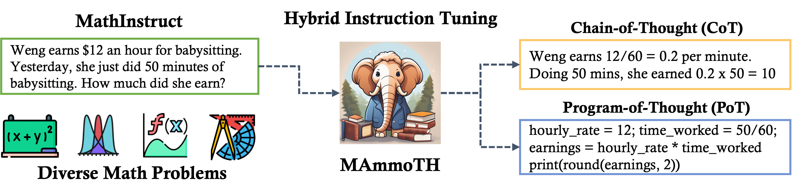

# **MAmmoTH** 🦣
This repo contains the code, data, and models for "[MAmmoTH: Building Math Generalist Models through Hybrid Instruction Tuning](https://arxiv.org/pdf/2309.05653.pdf)"

<div align="center">
 🔥 🔥 🔥 Check out our <a href = "https://tiger-ai-lab.github.io/MAmmoTH/">[Project Page]</a> for more results and analysis!
</div>

<br>
<div align="center">
  
</div>

### Datasets and Models
Our dataset and models are all available at Huggingface.

🤗 [MathInstruct Dataset](https://huggingface.co/datasets/TIGER-Lab/MathInstruct)

|     	| Base Model: Llama-2                                           	| Base Model: Code Llama                                                    	| Base Model: Mistral | 
|-----	|---------------------------------------------------------------	|---------------------------------------------------------------------------	|---------------------|
| 7B  	| 🦣 [MAmmoTH-7B](https://huggingface.co/TIGER-Lab/MAmmoTH-7B)   	| 🦣 [MAmmoTH-Coder-7B](https://huggingface.co/TIGER-Lab/MAmmoTH-Coder-7B)   | 🦣 [MAmmoTH-7B-Mistral](https://huggingface.co/TIGER-Lab/MAmmoTH-7B-Mistral) |
| 13B 	| 🦣 [MAmmoTH-13B](https://huggingface.co/TIGER-Lab/MAmmoTH-13B) 	| 🦣 [MAmmoTH-Coder-13B](https://huggingface.co/TIGER-Lab/MAmmoTH-Coder-13B) |                    |
| 34B 	| -                                                             	| 🦣 [MAmmoTH-Coder-34B](https://huggingface.co/TIGER-Lab/MAmmoTH-Coder-34B) 	|                    |
| 70B 	| 🦣 [MAmmoTH-70B](https://huggingface.co/TIGER-Lab/MAmmoTH-70B) 	| -                                                                         	|                    |

## **What's New?**

- [Dec. 4] We add the training and evaluation of MAmmoTH-7B-Mistral, which improves significantly over the LLaMA-2 version. We also have better support for vllm. 
- [Oct. 10] We update our decoding method to hybrid decoding: first try PoT to generate a program, if it is not excutable, we will regenerate a CoT solution as the final answer. This hybrid decoding method improves the peformance significantly. Check our updated paper Appendix for more details. 

## Highlights
We demonstrate the results of our small MAmmoTH-7B-Mistral as follows:

| **Model**             	| **Decoding** 	| **GSM**  	| **MATH** 	| **MMLU-Math** |
|---------------------------|---------------|-----------|-----------|-----------|
| MAmmoTH-7B             	| **Hybrid**   	| 53.6  	| 31.5 	    | 44.5   	|
| MAmmoTH-Coder-7B  	    | **Hybrid**   	| 59.4  	| 33.4  	| 47.2  	|
| MetaMath-7B-Mistral       | **CoT**   	| 77.7  	| 28.2 	    | 49.3      |
| OpenChat-3.5-7B           | **CoT**   	| 77.3 	    | 28.6 	    | 49.6      |
| ChatGLM-3-6B              | **CoT**       | 72.3      | 25.7      | 45.6      | 
| DeepSeek-Coder-34B        | **PoT**   	| 58.2   	| 35.3 	    | 46.5      |
| Grok-1                    | **CoT**       | 62.9      | 15.7      | -         |
| QWen-72B                  | **CoT**       | 78.9      | 35.2      | -         |
| DeepSeek-67B-Chat         | **CoT**       | **84.1**  | 32.6      | -         |
| MAmmoTH-7B-Mistral  	    | **Hybrid**   	| 75.0   	| **40.0** 	| **52.5**  |

## **Table of Contents**

- [📌 Introduction](#introduction)
- [⚙️ Installation](#installation)
- [🛠️ Training and Inference](#training-and-inference)
- [📜 License](#license)
- [📖 Citation](#citation)

## **Introduction**
We introduce MAmmoTH 🦣, a series of open-source large language models (LLMs) specifically tailored for general math problem-solving. The MAmmoTH models are trained on MathInstruct, a meticulously curated instruction tuning dataset that is lightweight yet generalizable. MathInstruct is compiled from 13 math rationale datasets, six of which are newly curated by this work. It uniquely focuses on the hybrid use of chain-of-thought (CoT) and program-of-thought (PoT) rationales, and ensures extensive coverage of diverse mathematical fields. 
## **Installation**

Clone this repository and install the required packages:

```bash
git clone https://github.com/TIGER-AI-Lab/MAmmoTH.git
cd MAmmoTH
pip install -r requirements.txt
```

## **Training and Inference**

### **Data Loading**

Run the following command to preprocess the data:

```python
from datasets import load_dataset

dataset = load_dataset("TIGER-Lab/MathInstruct")
```

### **Quick Start**
To play with our model, run:

```python
from transformers import pipeline
pipeline = pipeline("text-generation", "TIGER-Lab/MAmmoTH-Coder-7B")

alpaca_template = "Below is an instruction that describes a task. Write a response that appropriately completes the request.\n### Instruction:\n{query}\n\n### Response:"

query = "Janet's ducks lay 16 eggs per day. She eats three for breakfast every morning and bakes muffins for her friends every day with four. She sells the remainder at the farmers' market daily for $2 per fresh duck egg. How much in dollars does she make every day at the farmers' market?"

### By default, MAmmoTH will output the Chain-of-thought (CoT) rationale
rationale_prefix = ""

### You can let MAmmoTH output Program-of-thought (PoT) rationale by simply adding
rationale_prefix = " Let's write a program."

input = alpaca_template.format(query = query + rationale_prefix)

output = pipeline(input)[0]['generated_text']
print(output)
```

### **Large-scale Evaluation**

To replicate the experimental results in our paper, run:

```bash
### For open-eneded questions, the dataset should be one of 
### ['gsm8k', 'svamp', 'math', 'numglue', 'deepmind', 'simuleq'] 
### We first try PoT and if the generated program is not executable, we shift to CoT

dataset='math'

python run_open.py \
  --model "TIGER-Lab/MAmmoTH-7B-Mistral" \
  --shots 0 \
  --stem_flan_type "pot_prompt" \
  --batch_size 8 \
  --dataset $dataset \
  --model_max_length 1500 \
  --cot_backup \
  --print \
  --use_vllm
```

If you want to run self-consistency with PoT/CoT with 10 ensembles.

```bash
### For open-eneded questions, the dataset should be one of 
### ['gsm8k', 'svamp', 'math', 'numglue', 'deepmind', 'simuleq'] 
### We first try PoT and if the generated program is not executable, we shift to CoT
dataset='gsm8k'

python run_open_sc.py \
  --model "TIGER-Lab/MAmmoTH-7B-Mistral" \
  --shots 0 \
  --stem_flan_type "pot_prompt" \
  --batch_size 8 \
  --dataset $dataset \
  --model_max_length 1500 \
  --num_samples 10 \
  --print
```

```bash
### For mutilple-choice questions, the dataset should be one of 
### ['aqua', 'sat', 'mmlu_mathematics'].
### We first try PoT and if the generated program is not executable, we shift to CoT
dataset='aqua'

python run_choice.py \
  --model "TIGER-Lab/MAmmoTH-7B-Mistral" \
  --shots 0 \
  --stem_flan_type "pot_prompt" \
  --batch_size 8 \
  --dataset $dataset \
  --cot_backup \
  --print
```

### **Fine-tuning**

To train the 7B/13B model, run:

```bash
torchrun --nproc_per_node [$WORKER_GPU] \
 --master_addr [$WORKER_0_HOST] \
 --node_rank [$ROLE_INDEX] \
 --master_port [$WORKER_0_PORT] \
 --nnodes [$WORKER_NUM] \
train.py \
    --model_name_or_path "codellama/CodeLlama-7b-hf" \
    --data_path "TIGER-Lab/MathInstruct" \
    --bf16 True \
    --output_dir checkpoints/MAmmoTH-Coder-7B \
    --num_train_epochs 3 \
    --per_device_train_batch_size 2 \
    --per_device_eval_batch_size 1 \
    --gradient_accumulation_steps 8 \
    --evaluation_strategy "no" \
    --save_strategy "steps" \
    --save_steps 2000\
    --save_total_limit 1 \
    --learning_rate 2e-5 \
    --weight_decay 0. \
    --warmup_ratio 0.03 \
    --lr_scheduler_type "cosine" \
    --logging_steps 1 \
    --fsdp "full_shard auto_wrap" \
    --fsdp_transformer_layer_cls_to_wrap 'LlamaDecoderLayer' \
    --tf32 True
```

To train the 34B/70B model, run:
```bash
torchrun --nproc_per_node [$WORKER_GPU] \
 --master_addr [$WORKER_0_HOST] \
 --node_rank [$ROLE_INDEX] \
 --master_port [$WORKER_0_PORT] \
 --nnodes [$WORKER_NUM] \
train.py \
    --model_name_or_path "codellama/CodeLlama-34b-hf" \
    --data_path "TIGER-Lab/MathInstruct" \
    --bf16 True \
    --output_dir checkpoints/MAmmoTH-Coder-34B \
    --num_train_epochs 3 \
    --per_device_train_batch_size 1 \
    --per_device_eval_batch_size 1 \
    --gradient_accumulation_steps 2 \
    --evaluation_strategy "no" \
    --save_strategy "epoch" \
    --save_total_limit 1 \
    --learning_rate 1e-5 \
    --weight_decay 0. \
    --warmup_ratio 0.03 \
    --lr_scheduler_type "cosine" \
    --logging_steps 1 \
    --deepspeed "ds_config/ds_config_zero3.json" \
    --tf32 True
```

## Prompt Format

If you want to do CoT:
```
Below is an instruction that describes a task. Write a response that appropriately completes the request.

### Instruction:
{instruction}

### Response:
```

If you want to do PoT:
```
Below is an instruction that describes a task. Write a response that appropriately completes the request.

### Instruction:
{instruction} Let's write a program.

### Response:
```

## WebUI
We use [llama2-webui](https://github.com/liltom-eth/llama2-webui) as our ui bankend. To use webui for MammoTH run:
```
pip install gradio
cd webui/llama2-webui
python3 mammoth.py --model_path your_model_path --backend_type transformers 
```


## **License**
Please check out the license of each subset in our curated dataset MathInstruct.
| Dataset Name 	| License Type   	|
|--------------	|----------------	|
| GSM8K        	| MIT            	|
| GSM8K-RFT    	| Non listed      |
| AQuA-RAT     	| Apache 2.0     	|
| MATH         	| MIT            	|
| TheoremQA    	| MIT            	|
| Camel-Math   	| Attribution-NonCommercial 4.0 International    	|
| NumGLUE      	| Apache-2.0          	|
| CrowdSourced (Lila)	| Attribution 4.0 International     	|
| MathQA       	| Apache-2.0     	|
| Our Curated   | MIT             |


## **Citation**

Please cite our paper if you use our data, model or code. Please also kindly cite the original dataset papers. 

```
@article{yue2023mammoth,
  title={MAmmoTH: Building Math Generalist Models through Hybrid Instruction Tuning},
  author={Xiang Yue, Xingwei Qu, Ge Zhang, Yao Fu, Wenhao Huang, Huan Sun, Yu Su, Wenhu Chen},
  journal={arXiv preprint arXiv:2309.05653},
  year={2023}
}
```

