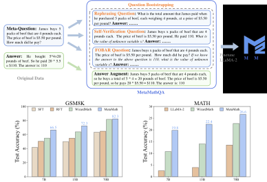

# MetaMath: Bootstrap Your Own Mathematical Questions for Large Language Models

[](CODE_LICENSE)
[](MetaMath/LICENSE)
[](https://www.python.org/downloads/release/python-390/)

<p align="center">
🤗 <a href="https://huggingface.co/meta-math" target="_blank">HF Repo</a> • 📃 <a href="https://arxiv.org/abs/2309.12284" target="_blank">[MetaMath]</a><br>
</p>

<p align="center" width="100%">
<a ></a>
</p>


## News
- 🔥 Our **MetaMath-Llemma-7B** model achieves  **30.0 pass@1** on the MATH Benchmarks, surpassing all the SOTA open-source LLM in 7B-13B scales! All the training scripts and the model are opened.
- 🔥 Our **MetaMath-Mistral-7B** model achieves  **77.7 pass@1** on the [GSM8k Benchmarks](https://github.com/openai/grade-school-math), surpassing all the SOTA open-source LLM! All the training scripts and the model are opened.
- 🔥 The full **MetaMathQA** dataset is now released in the huggingface [MetaMathQA](https://huggingface.co/datasets/meta-math/MetaMathQA/tree/main)!
- 🔥 We released the GSM8K_Backward dataset is also released in the huggingface [GSM8K_Backward](https://huggingface.co/datasets/meta-math/GSM8K_Backward) to evaluate the reversal mathematical reasoning ability!
- 🔥 Although the data augmentation for **MetaMathQA** is sourced from **ChatGPT 3.5**, Our **MetaMath-70B** model outperforms the closed-source LLMs **ChatGPT 3.5** on the GSM8K!
- 🔥 Our **MetaMath-7B** model achieves  **66.5 pass@1** on the [GSM8k Benchmarks](https://github.com/openai/grade-school-math), **11.6** points higher than the SOTA open-source LLM!
- 🔥 Our **MetaMath-7B** model achieves  **19.8 pass@1** on the [MATH Benchmarks](https://github.com/hendrycks/math), **9.1** points higher than the SOTA open-source LLM!

| Model | Checkpoint | Paper  | GSM8k | MATH  | License|
| ----- |------| ---- |------|-------| ----- |
| MetaMath-70B-V1.0 | 🤗 <a href="https://huggingface.co/meta-math/MetaMath-70B-V1.0" target="_blank">HF Link</a> |  📃 <a href="https://arxiv.org/abs/2309.12284" target="_blank">[MetaMath]</a>| **82.3**  |  **26.6**	| <a href="https://ai.meta.com/resources/models-and-libraries/llama-downloads/" target="_blank">Llama 2  </a> |
| MetaMath-13B-V1.0 | 🤗 <a href="https://huggingface.co/meta-math/MetaMath-13B-V1.0" target="_blank">HF Link</a> |  📃 <a href="https://arxiv.org/abs/2309.12284" target="_blank">[MetaMath]</a>| **72.3**  |  **22.4** | <a href="https://ai.meta.com/resources/models-and-libraries/llama-downloads/" target="_blank">Llama 2 </a> |
| MetaMath-7B-V1.0 | 🤗 <a href="https://huggingface.co/meta-math/MetaMath-7B-V1.0" target="_blank">HF Link</a>  |  📃 <a href="https://arxiv.org/abs/2309.12284" target="_blank">[MetaMath]</a>| 	 **66.5**  |  **19.8** |  <a href="https://ai.meta.com/resources/models-and-libraries/llama-downloads/" target="_blank">Llama 2  </a>|
| MetaMath-Mistral-7B | 🤗 <a href="https://huggingface.co/meta-math/MetaMath-Mistral-7B" target="_blank">HF Link</a>  |  📃 <a href="https://arxiv.org/abs/2309.12284" target="_blank">[MetaMath]</a>| 	 **77.7**  |  **28.2** |  <a href="http://www.apache.org/licenses/" target="_blank">Apache License 2.0  </a>|
| MetaMath-Llemma-7B | 🤗 <a href="https://huggingface.co/meta-math/MetaMath-Llemma-7B" target="_blank">HF Link</a>  |  📃 <a href="https://arxiv.org/abs/2309.12284" target="_blank">[MetaMath]</a>| 	 **69.2**  |  **30.0** |  <a href="http://www.apache.org/licenses/" target="_blank">Apache License 2.0  </a>|
                                                                                                                                                                                                                                                                                                   
                                                                                                                                                                                                                                                                                                                                                                             

## Comparing MetaMath with the LLM models.

🔥 Comprehensive Results

| Model               | GSM8k Pass@1 | MATH Pass@1 |
|---------------------|--------------|-------------|
| MPT-7B              | 6.8          | 3.0         |
| Falcon-7B           | 6.8          | 2.3         |
| LLaMA-1-7B          | 11.0         | 2.9         |
| LLaMA-2-7B          | 14.6         | 2.5         |
| MPT-30B             | 15.2         | 3.1         |
| LLaMA-1-13B         | 17.8         | 3.9         |
| GPT-Neo-2.7B        | 19.5         | --          |
| Falcon-40B          | 19.6         | 2.5         |
| Baichuan-chat-13B   | 23.9         | --          |
| Vicuna-v1.3-13B     | 27.6         | --          |
| LLaMA-2-13B         | 28.7         | 3.9         |
| InternLM-7B         | 31.2         | --          |
| ChatGLM-2-6B        | 32.4         | --          |
| GPT-J-6B            | 34.9         | --          |
| LLaMA-1-33B         | 35.6         | 3.9         |
| LLaMA-2-34B         | 42.2         | 6.24        |
| RFT-7B              | 50.3         | --          |
| LLaMA-1-65B         | 50.9         | 10.6        |
| Qwen-7B             | 51.6         | --          |
| WizardMath-7B       | 54.9         | 10.7        |
| LLaMA-2-70B         | 56.8         | 13.5        |
| WizardMath-13B      | 63.9         | 14.0        |
| 🔥 MetaMath-7B         | **66.5**     | **19.8**    |
| 🔥 MetaMath-13B        | **72.3**     | **22.4**    |
| 🔥 MetaMath-Mistral-7B | **77.7**     | **28.2**    |
| 🔥 MetaMath-Llemma-7B  | **69.2**     | **30.0**    |
| WizardMath-70B      | 81.6         | 22.7        |
| 🔥 MetaMath-70B        | **82.3**     | **26.6**    |

<h2 id="env">Quick Start</h2>

Clone Metamath and install the required packages:

```bash
git clone https://github.com/meta-math/MetaMath.git
cd MetaMath
pip install -r requirements.txt
```

If you encounter a Ray installation problem, please run:

```bash
pip install --upgrade ray
pip install --upgrade pyarrow
```

<h2 id="Inference">Dataset Usage</h2>

Run the following command to load the data:

```python
from datasets import load_dataset
dataset = load_dataset("meta-math/MetaMathQA")
```


<h2 id="train">Training</h2>

you need to prepare the  llama-2 base model and our **MetaMathQA** dataset huggingface [MetaMathQA](https://huggingface.co/datasets/meta-math/MetaMathQA/tree/main)

```
bash run.sh
```
or

```
CUDA_VISIBLE_DEVICES=0,1,2,3,4,5,6,7 python3 -m torch.distributed.launch --master_addr ${MASTER_ADDR} --master_port ${MASTER_PORT} --nproc_per_node=8 --use_env train_math.py \
    --model_name_or_path "path/to/llama-2" \
    --data_path "path/to/metamathqa" \
    --data_length 10000000 \
    --bf16 True \
    --output_dir "path/to/save" \
    --num_train_epochs 3 \
    --per_device_train_batch_size 4 \
    --per_device_eval_batch_size 4 \
    --gradient_accumulation_steps 4 \
    --evaluation_strategy "no" \
    --save_strategy "steps" \
    --save_steps 1000 \
    --save_total_limit 2 \
    --learning_rate 2e-5 \
    --weight_decay 0. \
    --warmup_ratio 0.03 \
    --lr_scheduler_type "cosine" \
    --logging_steps 1 \
    --fsdp "full_shard auto_wrap" \
    --fsdp_transformer_layer_cls_to_wrap 'LlamaDecoderLayer' \
    --tf32 True
```

### Supervised fine-tuning

We supervised fine-tune MetaMath-7B with the following hyperparameters:

| Hyperparameter | LLaMA 2 7B |
|----------------|-------------|
| Batch size     | 128         |
| Learning rate  | 2e-5        |
| Epochs         | 3           |
| Max length     | 512         |
| LR scheduler   | cosine      |

<h2 id="evaluation">Evaluation</h2>

we use the vllm to help the fast generation:

```
python eval_gsm8k.py --model "path/to/save" --data_file ./data/test/GSM8K_test.jsonl
python eval_math.py --model "path/to/save" --data_file ./data/test/MATH_test.jsonl
```
where the "path/to/save" should be replaced by the finetuned model, you can also download our series of MetaMath models in huggingface:  
🤗 <a href="https://huggingface.co/meta-math/MetaMath-7B-V1.0" target="_blank">MetaMath 7B</a> 🤗 <a href="https://huggingface.co/meta-math/MetaMath-13B-V1.0" target="_blank">MetaMath 13B</a> 🤗 <a href="https://huggingface.co/meta-math/MetaMath-70B-V1.0" target="_blank">MetaMath 70B</a>

The inference prompt for our MetaMath is:
```
"Below is an instruction that describes a task. Write a response that appropriately completes the request.\n\n### Instruction:\n{instruction}\n\n### Response: Let's think step by step."
```

Thanks for the open source code of [WizardMath](https://github.com/nlpxucan/WizardLM/tree/main/WizardMath) and [RFT](https://github.com/OFA-Sys/gsm8k-ScRel/tree/main). Some of our codes are based on them.

<h2 id="citation">Citation</h2>
Please cite the paper if you refer to our model, code, data or paper from MetaMath.

```
@article{yu2023metamath,
  title={MetaMath: Bootstrap Your Own Mathematical Questions for Large Language Models},
  author={Yu, Longhui and Jiang, Weisen and Shi, Han and Yu, Jincheng and Liu, Zhengying and Zhang, Yu and Kwok, James T and Li, Zhenguo and Weller, Adrian and Liu, Weiyang},
  journal={arXiv preprint arXiv:2309.12284},
  year={2023}
}
```
