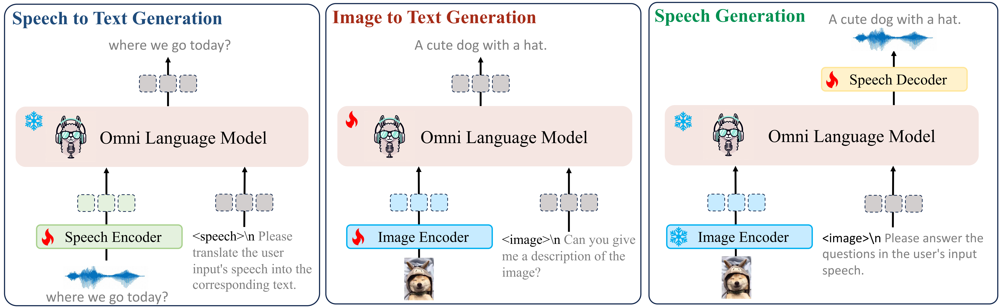

<div align=center>

</div>

# OpenOmni: Large Language Models Pivot Zero-shot Omnimodal Alignment across Language with Real-time Self-Aware Emotional Speech Synthesis

## <font style="color:rgb(31, 35, 40);">👀</font><font style="color:rgb(31, 35, 40);"> Contents</font>
+ <font style="color:rgb(31, 35, 40);">Setup</font>
+ <font style="color:rgb(31, 35, 40);">Model</font>
+ <font style="color:rgb(31, 35, 40);">Preparation</font>
+ <font style="color:rgb(31, 35, 40);">Train</font>
+ <font style="color:rgb(31, 35, 40);">Evaluation</font>
+ <font style="color:rgb(31, 35, 40);">Example</font>
+ <font style="color:rgb(31, 35, 40);">Citation</font>

## <font style="color:rgb(31, 35, 40);">📷</font><font style="color:rgb(31, 35, 40);"> Setup</font>
<font style="color:rgb(31, 35, 40);">Please follow the instructions below to install the required packages.</font>

1. <font style="color:rgb(31, 35, 40);">Clone this repository</font>

```plain
git clone https://github.com/AlibabaResearch/DAMO-ConvAI/tree/main/OpenOMNI.git
cd OpenOMNI
```

1. <font style="color:rgb(31, 35, 40);">Install Package</font>

```plain
conda create -n openomni python=3.10 -y
conda activate openomni
pip install --upgrade pip  # enable PEP 660 support
pip install -e .
pip install openai-whisper
pip install transformers==4.43.4
```

1. <font style="color:rgb(31, 35, 40);">Install additional packages for training</font>

```plain
pip install -e ".[train]"
pip install flash-attn --no-build-isolation
```

## <font style="color:rgb(31, 35, 40);">Model</font>


<font style="color:rgb(31, 35, 40);">Here are the pretrained weights and instruction tuning weights</font>

| Stage | <font style="color:rgb(31, 35, 40);">Model</font> | <font style="color:rgb(31, 35, 40);">Speech Projector</font> | <font style="color:rgb(31, 35, 40);">Image</font><br/><font style="color:rgb(31, 35, 40);">Projector</font> | <font style="color:rgb(31, 35, 40);">IT Data</font> | <font style="color:rgb(31, 35, 40);">Download</font> |
| --- | --- | --- | --- | --- | --- |
| 1-1 | <font style="color:rgb(31, 35, 40);">OpenOMNI-Qwen2-7B-Stage1-1</font> |  |  | <font style="color:rgb(31, 35, 40);">aishell2+wetnetspeech+librispeech</font> | ckpt |
| 2-1 | <font style="color:rgb(31, 35, 40);">OpenOMNI-Qwen2-7B-Stage2-1</font> |  |  | <font style="color:rgb(31, 35, 40);">llava-pretrain</font> | ckpt |
| 2-2 | <font style="color:rgb(31, 35, 40);">OpenOMNI-Qwen2-7B-Stage2-2</font> |  |  | <font style="color:rgb(31, 35, 40);">mmevol</font> | ckpt |
| 3-1 | <font style="color:rgb(31, 35, 40);">OpenOMNI-Qwen2-7B-Stage3-1</font> |  |  | <font style="color:rgb(31, 35, 40);">openomni-1M</font> | ckpt |
| 3-2 | <font style="color:rgb(31, 35, 40);">OpenOMNI-Qwen2-7B-Stage3-2</font> |  |  | <font style="color:rgb(31, 35, 40);">openomni-prefer</font> | ckpt |


## <font style="color:rgb(31, 35, 40);">Preparation</font>
### <font style="color:rgb(31, 35, 40);">Dataset</font>
<font style="color:rgb(31, 35, 40);">Please follow [MMEvol](https://github.com/AlibabaResearch/DAMO-ConvAI/tree/main/mmevol) to prepare the corresponding images-text datasets. Here we provide the details of speech-text datasets.</font>

### <font style="color:rgb(31, 35, 40);">data structure</font>
```plain
datasets
├── json # data receipe
│   ├── openomni_stage1-1.json # speech2text pretraining
│   ├── openomni_stage2-1.json # image2text pretraining
│   ├── openomni_stage2-2.json # image2text instruction tuning
│   ├── openomni_stage3-1.json # text2speech pretraining
│   ├── openomni_stage3-2.json # text2speech emotional injection
├── asr # classic bilingual speech corpus
│   ├── AISHELL-4
│   ├── LibriSPeech
│   ├── WeNetSpeech
├── audio_en # synthetic english speech corpus for question
├── audio_llava # synthetic bilingual speech corpus for answer
├── audio_zh # synthetic chinese speech corpus for question
├── audio_unit # synthetic bilingual speech corpus for answer
├── audio_prefer # synthetic emotional bilingual speech corpus for answer
├── audio_reject # synthetic emotional bilingual speech corpus for answer
├── audio_ultrachat # synthetic bilingual speech corpus for answer
├── ai2d
│   ├── abc_images
│   ├── annotations
│   ├── images
│   ├── questions
│   └── categories.json
......


```

+ All file/path starting with "audio" are self-synthesized.  
+ DPO contains approximately 9k entries for "prefer" and "reject," covering 9 types of emotions.

## <font style="color:rgb(31, 35, 40);">Train</font>
### <font style="color:rgb(31, 35, 40);">Speech2Text Pretrain</font>
<font style="color:rgb(31, 35, 40);">Please download the MMEvol, AIShell-4, LibriSPeech, WeNetSpeech,  OpenOmniData and organize the data following Preparation before training .  Make sure set up the corresponding train script with correct setting (data path, weight path, and hyper-paramaters)</font>

```plain
bash scripts/train/llama3/speech2text_pretrain.sh
bash scripts/train/qwen2/speech2text_pretrain.sh
```

### <font style="color:rgb(31, 35, 40);">Image2Text Pretrain</font>
<font style="color:rgb(31, 35, 40);">Please make sure you download and organize the data following</font><font style="color:rgb(31, 35, 40);"> </font>[<font style="color:rgb(31, 35, 40);">Preparation</font>](https://github.com/RainBowLuoCS/MMEvol#preparation)<font style="color:rgb(31, 35, 40);"> </font><font style="color:rgb(31, 35, 40);">before training. Make sure set up the corresponding train script with correct setting (data path, weight path, and hyper-paramaters)</font>

```plain
bash scripts/train/llama3/image2text_pretrain.sh
bash scripts/train/qwen2/image2text_pretrain.sh
```

### <font style="color:rgb(31, 35, 40);">Image2Text Instruction Tuning</font>
<font style="color:rgb(31, 35, 40);">Please make sure you download and organize the data following</font><font style="color:rgb(31, 35, 40);"> </font>[<font style="color:rgb(31, 35, 40);">Preparation</font>](https://github.com/RainBowLuoCS/MMEvol#preparation)<font style="color:rgb(31, 35, 40);"> </font><font style="color:rgb(31, 35, 40);">before training. Make sure set up the corresponding train script with correct setting (data path, weight path, and hyper-paramaters)</font>

```plain
bash scripts/train/llama3/image2text_finetune.sh
bash scripts/train/qwen2/image2text_finetue.sh
```

### <font style="color:rgb(31, 35, 40);">Text2Speech Pretrain</font>
<font style="color:rgb(31, 35, 40);">Please make sure you download and organize the data following</font><font style="color:rgb(31, 35, 40);"> </font>[<font style="color:rgb(31, 35, 40);">Preparation</font>](https://github.com/RainBowLuoCS/MMEvol#preparation)<font style="color:rgb(31, 35, 40);"> </font><font style="color:rgb(31, 35, 40);">before training. Make sure set up the corresponding train script with correct setting (data path, weight path, and hyper-paramaters)</font>

```plain
bash scripts/train/llama3/text2speech_ pretrain.sh
bash scripts/train/qwen2/text2speech_ pretrain.sh
```

### <font style="color:rgb(31, 35, 40);">Text2Speech Emotional DPO Tuning</font>
<font style="color:rgb(31, 35, 40);">Please make sure you download and organize the data following</font><font style="color:rgb(31, 35, 40);"> </font>[<font style="color:rgb(31, 35, 40);">Preparation</font>](https://github.com/RainBowLuoCS/MMEvol#preparation)<font style="color:rgb(31, 35, 40);"> </font><font style="color:rgb(31, 35, 40);">before training. Make sure set up the corresponding train script with correct setting (data path, weight path, and hyper-paramaters)</font>

```plain
bash scripts/train/llama3/text2speech_ dpo.sh
bash scripts/train/qwen2/text2speech_ dpo.sh
```

## <font style="color:rgb(31, 35, 40);">Evaluation</font>
### <font style="color:rgb(31, 35, 40);">Dataset</font>
#### <font style="color:rgb(31, 35, 40);">Ensure that your api_base, key and dataset are correctly configured before evaluation.</font>
### <font style="color:rgb(31, 35, 40);">data structure</font>
```plain
datasets
├── json # data receipe
│   ├── aishell2_eval.jsonl # aishell evaluation
│   ├── librispeech_eval.jsonl # image2text pretraining
│   ├── wenetspeech_eval.json # image2text instruction tuning
│   ├── openomni_emotion_val.json 
├── OmniBench # OmniBench
│   ├── mmdata
│   ├── dataset
│   		├── eval.json
├── Ov-Odyssey # Ov-Odyssey Bench
│   ├── av_odyssey_part1.parquet
│   ├── av_odyssey_part2.parquet
│   ├── av_odyssey_part3.parquet
│   ├── av_odyssey_part4.parquet
│   ├── av_odyssey_part5.parquet


```

### <font style="color:rgb(31, 35, 40);">Speech-Text Evaluation </font>
<font style="color:rgb(31, 35, 40);">Make sure set up the corresponding train script with correct setting (data path, weight path, and hyper-paramaters)</font>

```plain
python openomni/eval/llama3/asr_eavl.py
python openomni/eval/qwen2/asr_eavl.py
```

| <font style="color:rgb(31, 35, 40);">Model</font> | <font style="color:rgb(31, 35, 40);">LibriSpeech-test-clean</font> | <font style="color:rgb(31, 35, 40);">LibriSpeech-test-other</font> | <font style="color:rgb(31, 35, 40);">AIShell2-dev</font> | <font style="color:rgb(31, 35, 40);">AIShell2-test</font> | <font style="color:rgb(31, 35, 40);">WeNetSpeech-testnet</font> | <font style="color:rgb(31, 35, 40);">WeNetSpeech-testmeeting</font> |
| --- | --- | --- | --- | --- | --- | --- |
| <font style="color:rgb(31, 35, 40);">VITA</font> | 8.1 | 18.4 | <font style="color:rgb(31, 35, 40);"></font> | <font style="color:rgb(31, 35, 40);"></font> | <font style="color:rgb(31, 35, 40);">12.2</font> | <font style="color:rgb(31, 35, 40);">16.5</font> |
| <font style="color:rgb(31, 35, 40);">EMOVA</font> | 4.0 | 8.6 | <font style="color:rgb(31, 35, 40);">10.6</font> | <font style="color:rgb(31, 35, 40);">10.3</font> | <font style="color:rgb(31, 35, 40);"></font> | <font style="color:rgb(31, 35, 40);"></font> |
| <font style="color:rgb(31, 35, 40);">MINI-OMNI</font> | 4.5 | 9.7 | <font style="color:rgb(31, 35, 40);"></font> | <font style="color:rgb(31, 35, 40);"></font> | <font style="color:rgb(31, 35, 40);"></font> | <font style="color:rgb(31, 35, 40);"></font> |
| <font style="color:rgb(31, 35, 40);">Freeze-Omni</font> | 3.29 | 7.4 | <font style="color:rgb(31, 35, 40);"></font> | <font style="color:rgb(31, 35, 40);"></font> | <font style="color:rgb(31, 35, 40);">8.57</font> | <font style="color:rgb(31, 35, 40);">10.09</font> |
| <font style="color:rgb(31, 35, 40);">ours</font> | 2.57 | 5.6 | <font style="color:rgb(31, 35, 40);">6.81</font> | <font style="color:rgb(31, 35, 40);">6.87</font> | <font style="color:rgb(31, 35, 40);">7.63</font> | <font style="color:rgb(31, 35, 40);"></font> |


### <font style="color:rgb(31, 35, 40);">Image-Text Evaluation </font>
<font style="color:rgb(31, 35, 40);">Refer to MMEvol for detailed OpenCampass Vision Language Evaluation</font>

```plain
# run on all 9 datasets
./script/run_inference.sh OpenOmni-Qwen "MME MMMU_DEV_VAL MathVista_MINI LLaVABench RealWorldQA MMStar MMVet AI2D_TEST OCRBench HallusionBench POPE BLINK" all

# The following are instructions for running on a single dataset
# MME
./script/run_inference.sh OpenOmni-Qwen MME all
# MMMU_DEV_VAL
./script/run_inference.sh OpenOmni-Qwen MMMU_DEV_VAL all
# MathVista_MINI
./script/run_inference.sh OpenOmni-Qwen MathVista_MINI all
.....
```

### <font style="color:rgb(31, 35, 40);">Speech-Text-Image Evaluation </font>
<font style="color:rgb(31, 35, 40);">Please download OmniBench and run the following command</font>

```plain
python openomni/eval/llama3/omni_eavl.py
python openomni/eval/qwen2/omni_eavl.py
```

### <font style="color:rgb(31, 35, 40);">Speech-Text-Image-Video Evaluation </font>
<font style="color:rgb(31, 35, 40);">Please download Ov-Odyssey and run the following command</font>

```plain
python openomni/eval/llama3/ov_odyssey_eavl.py
python openomni/eval/qwen2/ov_odyssey_eavl.py
```


### <font style="color:rgb(31, 35, 40);">Text-Speech Evaluation </font>
```plain
python openomni/eval/llama3/t2s_eavl.py
python openomni/eval/qwen2/t2s_eavl.py
```

### <font style="color:rgb(31, 35, 40);">Emotional Text-Speech Evaluation </font>
```plain
python openomni/eval/llama3/et2s_eavl.py
python openomni/eval/qwen2/et2s_eavl.py
```


## <font style="color:rgb(31, 35, 40);">📚</font><font style="color:rgb(31, 35, 40);">Citation</font> 

If you find this repo useful for your research, please consider citing the paper

```
@article{luo2024openomni,
  title={OpenOmni: Large Language Models Pivot Zero-shot Omnimodal Alignment across Language with Real-time Self-Aware Emotional Speech Synthesis},
  author={Run Luo, Ting-En Lin, Haonan Zhang, Yuchuan Wu, Xiong Liu, Min Yang, Yongbin Li, Longze Chen, Jiaming Li, Lei Zhang, Yangyi Chen, Hamid Alinejad-Rokny, Fei Huang},
  journal={arXiv preprint arXiv:2409.05840},
  year={2024}
}
```

## <font style="color:rgb(31, 35, 40);">📧 </font><font style="color:rgb(31, 35, 40);">Contact</font> 

if you have any question, please consider following concat for help

- Run Luo — r.luo@siat.ac.cn

- Haonan Zhang — zchiowal@gmail.com
