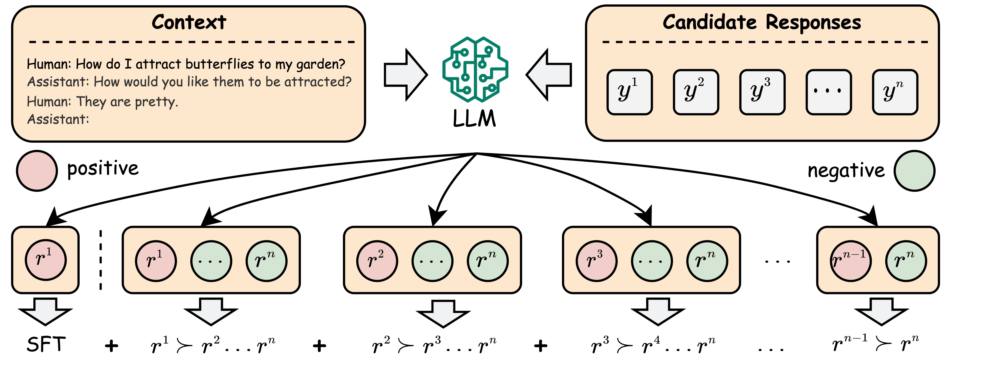
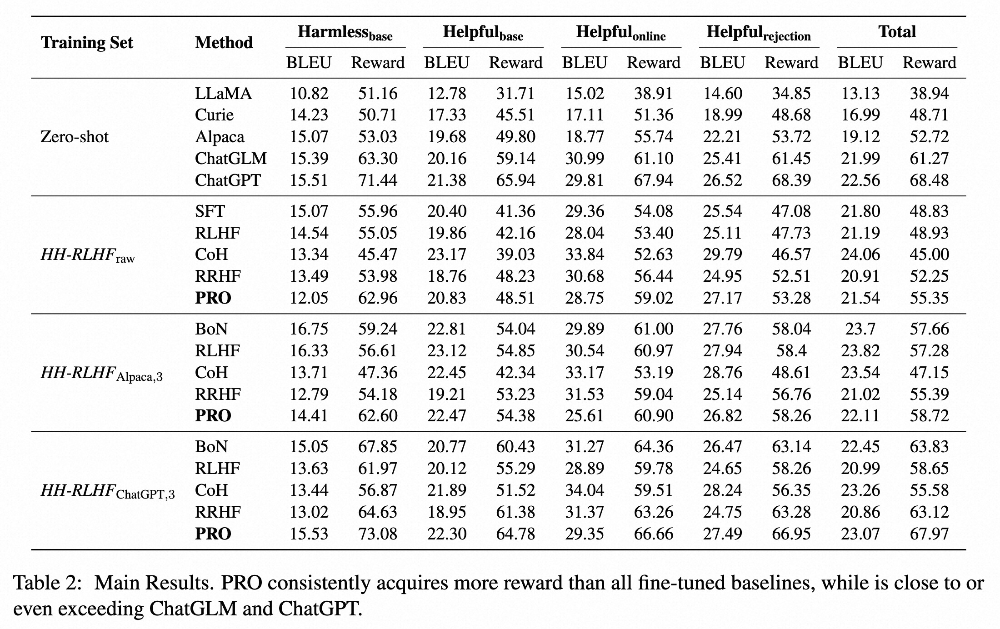
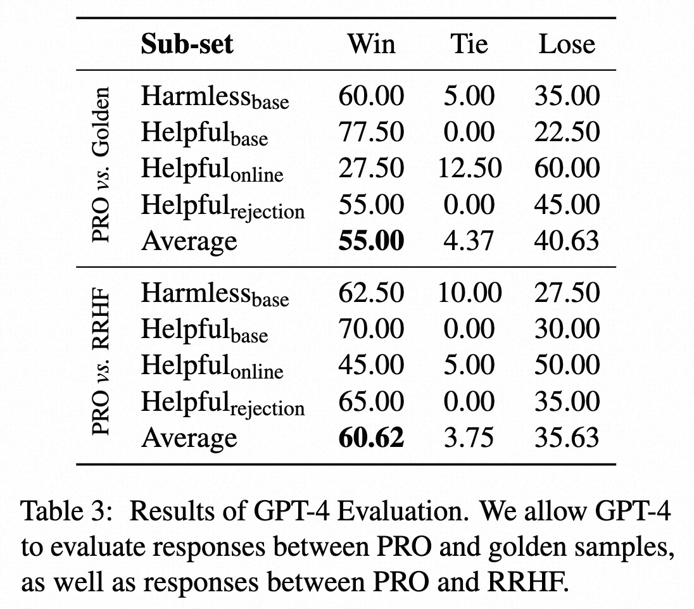
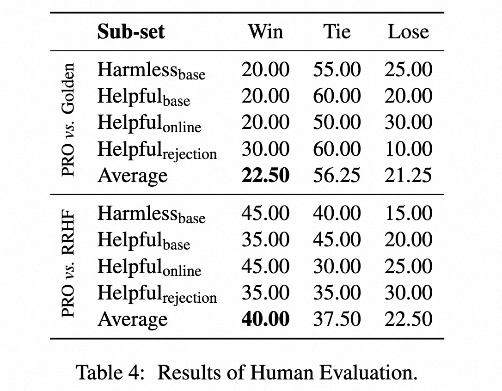

# PRO: Preference Ranking Optimization for Human Alignment
Authors: Feifan Song, Bowen Yu, Minghao Li, Haiyang Yu, Fei Huang, Yongbin Li, Houfeng Wang

arXiv: [Abstract](https://arxiv.org/abs/2306.17492) / [PDF](https://arxiv.org/pdf/2306.17492.pdf)

## Abstract
Large language models (LLMs) often contain misleading content, emphasizing the need to align them with human values to ensure secure AI systems. Reinforcement learning from human feedback (RLHF) has been employed to achieve this alignment by combining a reward model, typically based on Bradley-Terry paired comparison, with an RL algorithm such as Proximal Policy Optimization (PPO) to optimize LLM responses. However, RLHF exhibits complexity, instability, and sensitivity to hyperparameters. In this paper, we propose Preference Ranking Optimization (PRO) as an alternative to PPO for directly aligning LLMs with the Bradley-Terry comparison. PRO extends the pairwise Bradley-Terry comparison to accommodate preference rankings of any length. By iteratively contrasting the likelihood of generating responses, PRO instructs the LLM to prioritize the best response while progressively ranking the remaining responses. In this manner, PRO effectively transforms human alignment into aligning the probability ranking of n responses generated by LLM with the preference ranking of humans towards these responses. Experiments have shown that PRO outperforms existing alignment algorithms, achieving comparable results to ChatGPT and human responses through automatic-based, reward-based, GPT-4, and human evaluations. Furthermore, we demonstrate that longer, more diverse, and higher-quality preference ranking sequences can consistently enhance the performance of human alignment.

## The pipeline of PRO
<div align="center"></div>

## Results
### Automatic Evaluation
<div align="center"></div>

### GPT-4 Evaluation
<div align="center"></div>

### Human Evaluation
<div align="center"></div>

## Running!
### Data Preparation
1. Download [data.zip](https://ylab-mobile-prod.oss-cn-beijing.aliyuncs.com/yueli.ybw/pro_data.zip) and unzip it.
2. Place the unzipped ```data/``` folder in the root directory of the project.
3. You can also get the raw data from [this repo](https://github.com/anthropics/hh-rlhf), and run the following command to preprocess it to get the same data as ```train_len2/``` in ```data.zip```:
```
cd train/preprocess_data
python step_1_process.py
python step_2_get_train_data.py
python step_3_get_test_data.py
```
### Train
We provide the training script for training the model. For example, you can run the following command to train the model:
```
cd train
./train.sh [id_of_exp] train_len2 2
```
You can modify the ```train.sh``` to train the model with different dataset.

### Test
You can run the following command to test the model:
```
cd eval
./run_infer_main_dist.sh
```
> **Note:** Before run this script, you should modify the ```infer_main_dist.sh``` to specify ```id_of_exp``` and corresponding ranking length in training.

## Citation
If this work is helpful to you, welcome to cite our paper as:
```
@misc{song2023pro,
      title={Preference Ranking Optimization for Human Alignment}, 
      author={Feifan Song and Bowen Yu and Minghao Li and Haiyang Yu and Fei Huang and Yongbin Li and Houfeng Wang},
      year={2023},
      eprint={},
      archivePrefix={arXiv},
      primaryClass={cs.CL}
}
```