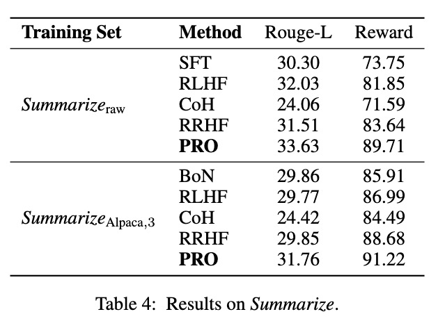

# PRO: Preference Ranking Optimization for Human Alignment
Authors: Feifan Song, Bowen Yu, Minghao Li, Haiyang Yu, Fei Huang, Yongbin Li, Houfeng Wang

arXiv: [Abstract](https://arxiv.org/abs/2306.17492) / [PDF](https://arxiv.org/pdf/2306.17492.pdf)

## Abstract
Large language models (LLMs) often contain misleading content, emphasizing the need to align them with human values to ensure secure AI systems. Reinforcement learning from human feedback (RLHF) has been employed to achieve this alignment. However, it encompasses two main drawbacks: (1) RLHF exhibits complexity, instability, and sensitivity to hyperparameters in contrast to SFT. (2) Despite massive trial-and-error, multiple sampling is reduced to pair-wise contrast, thus lacking contrasts from a macro perspective. In this paper, we propose Preference Ranking Optimization (PRO) as an efficient SFT algorithm to directly fine-tune LLMs for human alignment. PRO extends the pair-wise contrast to accommodate preference rankings of any length. By iteratively contrasting candidates, PRO instructs the LLM to prioritize the best response while progressively ranking the rest responses. In this manner, PRO effectively transforms human alignment into aligning the probability ranking of n responses generated by LLM with the preference ranking of humans towards these responses. Experiments have shown that PRO outperforms baseline algorithms, achieving comparable results to ChatGPT and human responses through automatic-based, reward-based, GPT-4, and human evaluations.

## The pipeline of PRO
<div align="center"></div>

## Results
### Automatic Evaluation on *HH-RLHF*
<div align="center"></div>

### GPT-4 Evaluation
<div align="center"></div>

### Human Evaluation
<div align="center"></div>

### Automatic Evaluation on *Summarize From Feedback*
<div align="center"></div>

## Running!
### Data Preparation
We provide the preprocessed data for training and testing, which can be get with following steps:
1. Download [data.zip](https://ylab-mobile-prod.oss-cn-beijing.aliyuncs.com/yueli.ybw/data.zip) and unzip it.
2. Place the unzipped ```data``` folder in the root directory of the project.

Besides, we also provide the scripts for preprocessing the raw data. Please follow the steps below to prepare the data:
1. Create a directory named ```data``` in the root directory of this project.
2. Create a directory named ```data/raw_data``` in the ```data``` directory.
3. Download the raw data from [*HH-RLHF*](https://github.com/anthropics/hh-rlhf) or [*Summarize From Feedback*](https://github.com/openai/summarize-from-feedback), which should be named as ```hhrlhf``` or ```summarize_from_feedback```, and put it in the ```data/raw_data``` directory.
4. Run the following command to preprocess the data:

```
# For HH-RLHF
cd train/hh_preprocess_data
python step_1_process.py
python step_2_get_train_data.py
python step_3_get_test_data.py

# For Summarize From Feedback
cd ../summarize_preprocess_data
python step_1_process.py
python step_2_get_train_data.py
python step_3_get_test_data.py
```

### Train
We provide the training scripts for training the model. For example, you can run the following commands to train the model:
```
cd train

# Train LLMs with HH-RLHF
./train_hh.sh [id_of_exp] hh_train_len2 2

# Train LLMs with Summarize From Feedback
./train_summarize.sh [id_of_exp] summarize_train_len2 2
# Length 3
./train3_summarize.sh [id_of_exp] summarize_train_len3_alpaca 3
```

The scripts can be easily modified to train LLMs with different datasets. 

### Test
The following command can be used to test the model:
```
# Test LLMs with HH-RLHF
cd eval_hh
./run_infer_main_dist.sh

# Test LLMs with Summarize From Feedback
cd ../eval_summarize
./run_infer_main_dist.sh
```
> **Note:** Before running, the ```id_of_exp``` and corresponding ranking length (during training) in ```run_infer_main_dist.sh``` have to be specified.

## Citation
If this work is helpful to you, welcome to cite our paper as:
```
@misc{song2023pro,
      title={Preference Ranking Optimization for Human Alignment}, 
      author={Feifan Song and Bowen Yu and Minghao Li and Haiyang Yu and Fei Huang and Yongbin Li and Houfeng Wang},
      year={2023},
      eprint={2306.17492},
      archivePrefix={arXiv},
      primaryClass={cs.CL}
}
```