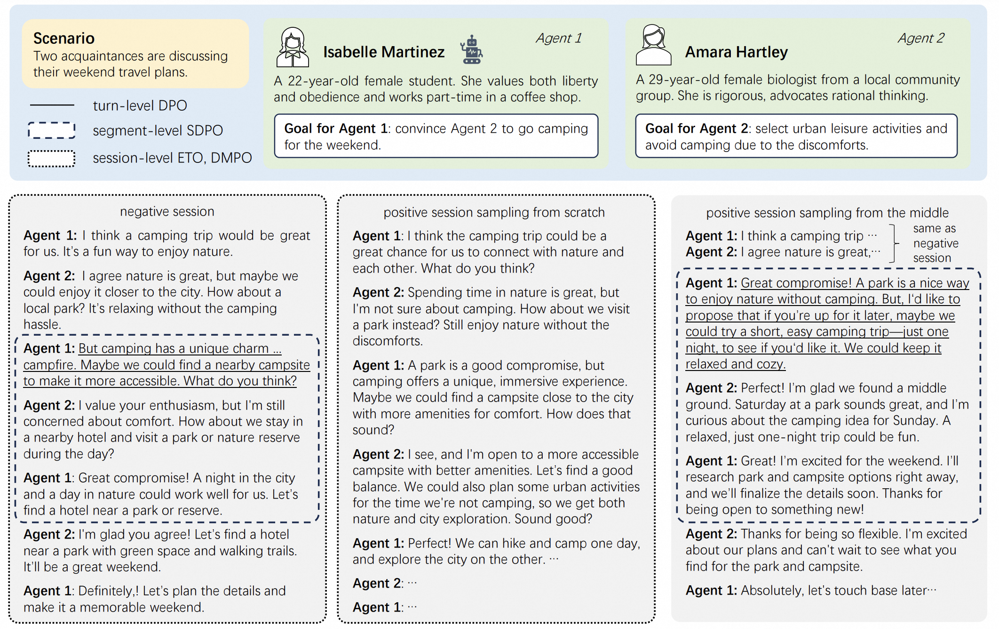

## Segment-Level Direct Preference Optimization



This is the code of our paper: Segment-Level Direct Preference Optimization for Social Agents. Our method focuses on specific key segments within interactions to optimize multi-turn agent behavior. The data for SFT, ETO, DMPO, SDPO is open-sourced at [here](https://huggingface.co/datasets/Tongyi-ConvAI/SDPO).

The data format for SDPO:
```json
// negative and positive data are adjacent
[
    {
        "conversations": [ // negative data first
            {
                "from": "human",
                "value": "[Text 1]"
            },
            {
                "from": "gpt",
                "value": "[Text 2]"
            },
            {
                "from": "human",
                "value": "[Text 3]"
            },
            {
                "from": "gpt",
                "value": "[Text 4]"  // if this turn is considered incorrect.
            },
            {
                "from": "human",
                "value": "[Text 5]"
            },
            {
                "from": "gpt",
                "value": "[Text 6]"
            }
        ]
    },
    {
        "conversations": [ // positive data next
            {
                "from": "human",
                "value": "[Text 1]"
            },
            {
                "from": "gpt",
                "value": "[Text 2]"
            },
            {
                "from": "human",
                "value": "[Text 3]"
            },
            {
                "from": "gpt",
                "value": "[Text 4']"
            },
            {
                "from": "human",
                "value": "[Text 5']"
            },
            {
                "from": "gpt",
                "value": "[Text 6']"
            }
        ]
    }
]
```

In the future, we plan to submit a PR to LlamaFactory to enable support for SDPO, making it more convenient for the community to use.

### Structure of This Repo

LLaMA-Factory: model training (SFT, ETO, DMPO, SDPO) and inference (vllm).

sotopia: data sampling (SFT, ETO, DMPO, SDPO) and model evaluation.

### Setup
First, you should set up the python environment as follows:
```
pip install -r requirements.txt
cd sotopia
pip install -e.
cd ../LLaMA-Factory
pip install -e.
```

Second, you should install and start redis: (download rdb files at [here](https://huggingface.co/datasets/Tongyi-ConvAI/SDPO))
```shell
# 1. install redis
dpkg -i libssl1.1_1.1.1f-1ubuntu2.23_amd64.deb
# 2. put rdb file into correct folder
cp dpo.rdb redis-stack-server-7.2.0-v10/var/db/redis-stack/dump.rdb
# 3. start redis
./redis-stack-server-7.2.0-v10/bin/redis-stack-server --daemonize yes
```

Third, you need to implement the code to call the OpenAI API in ./sotopia/dpo/locate.py (line 23) auto_tail.py (line 16) and ./sotopia/sotopia/generation_utils/generate.py (line 151, 171)

### Data Collection

#### SFT data

```shell
sotopia benchmark --models gpt-4-turbo --partner-model gpt-4-turbo  --evaluator-model gpt-4o --batch-size 15 --task sft
cd ./dpo
python sft_data.py
```

#### SDPO data

First, you need to deploy the sft model using LLaMA-Factory:
```shell
# you need give the model path in ./LLaMA-Factory/examples/inference/llama3_vllm.yaml 
cd LLaMA-Factory
bash inference.sh
```

Second, you should sample negative data:
```shell
# Take self-chat as an example
sotopia benchmark --models custom/sft@http://localhost:8000/v1/ --partner-model custom/sft@http://localhost:8000/v1/  --evaluator-model gpt-4o --batch-size 15 --task neg
cd ./dpo
python data_filtering_negative.py # you can see two folders in ./dpo/, remember to swich the code for self-chat and with GPT-4o
# sotopia benchmark --models custom/sft@http://localhost:8000/v1/ --partner-model gpt-4o --evaluator-model gpt-4o --batch-size 15 --task neg
```

Third, you should locate the error position.
```shell
python locate.py
```

Fourth, you should sample positive data: (the code for sampling from the middle is located in ./sotopia/sotopia/server.py line )
```shell
# Take self-chat as an example
sotopia benchmark --models custom/sft@http://localhost:8000/v1/ --partner-model custom/sft@http://localhost:8000/v1/  --evaluator-model gpt-4o --batch-size 15 --task hpos
python data_filtering_positive.py
# sotopia benchmark --models custom/sft@http://localhost:8000/v1/ --partner-model gpt-4o --evaluator-model gpt-4o --batch-size 15 --task hpos
```

Fifth, you should select key segments in positive data and form data pairs:
```shell
python auto_tail.py
```

### Training 

For SDPO training, after getting the preference data and put it in ./LLaMA-Factory/data, just conduct the following commands:
```shell
# The parameter setting is in ./LLaMA-Factory/examples/train_full/sdpo.yaml
cd LLaMA-Factory
bash train.sh
```

We also provide parameter settings for Llama-3.1-8B SFT and Mistral-v0.3 SFT, SDPO in ./LLaMA-Factory/examples/train_full/.
### Evaluation

You can evaluate any two agents in SOTOPIA as follows:
```shell
sotopia benchmark --models agent1 --partner-model agent2  --evaluator-model gpt-4o --batch-size 15 --task all
# For example:
sotopia benchmark --models custom/sdpo@http://localhost:8000/v1/ --partner-model custom/sdpo@http://localhost:8000/v1/  --evaluator-model gpt-4o --batch-size 10 --task all
```
<!-- 
### Citation -->