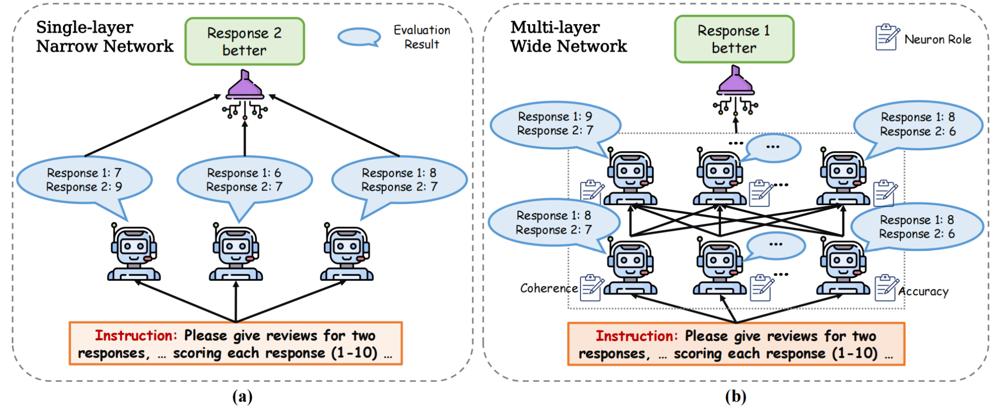
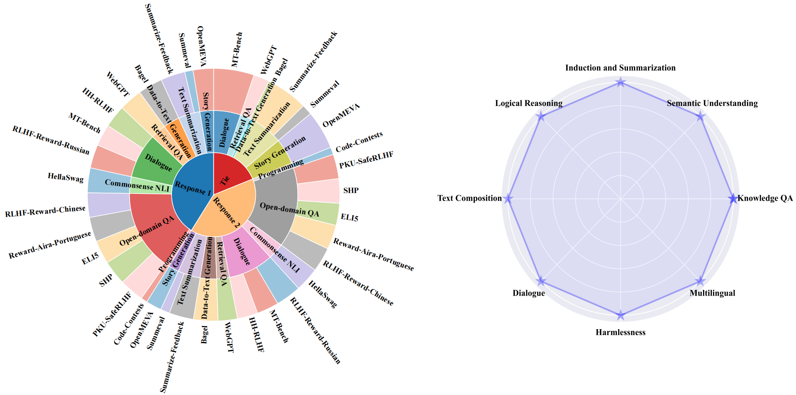

# Wider and Deeper LLM Networks are Fairer LLM Evaluators
Xinghua Zhang, Bowen Yu, Haiyang Yu, Yangyu Lv, Tingwen Liu, Fei Huang, Hongbo Xu, Yongbin Li

arXiv: [[Abstract]](https://aps.arxiv.org/abs/2308.01862)/[[PDF]](https://aps.arxiv.org/pdf/2308.01862.pdf)
 
## Abstract
Measuring the quality of responses generated by large language models (LLMs) is a challenging task, particularly when it comes to evaluating whether the response is aligned with human preference. A novel approach involves using the LLM itself to make evaluation and stabilizing the results through multiple independent evaluations, similar to a single-layer narrow LLM network. This network consists of a fixed number of neurons, with each neuron being the same LLM. In this paper, we draw upon the extensive research on deep neural networks to explore whether deeper and wider networks can lead to fairer evaluations. Specifically, inspired by the observation that different neurons in a neural network are responsible for detecting different concepts, we first adaptively generate as many neuron roles as possible for each evaluation sample. Each perspective corresponds to the role of a specific LLM neuron in the first layer. In subsequent layers, we follow the idea that higher layers in deep networks are responsible for more comprehensive features, each layer receives representations from all neurons in the previous layer, integrating the locally learned evaluation information to obtain a more comprehensive evaluation result. Interestingly, this network design resembles the process of academic paper reviewing, where each reviewer independently rates based on their preferences. Subsequently, through multiple discussions, they consider other reviewers' opinions to reach the final acceptance decision. To validate the effectiveness of our method, we construct the largest and most diverse English evaluation benchmark LLMEval² for LLM evaluators, comprising 15 tasks, 8 abilities, and 2,553 samples. Experimental results demonstrate that a wider network (involving many reviewers) with 2 layers (one round of discussion) performs the best, improving kappa correlation coefficient from 0.28 to 0.34. We also leverage WideDeep to aid in the assessment of Chinese LLMs, which has accelerated the evaluation time by 4.6 times, resulting in a 60% cost saving. WideDeep achieves a remarkable 93% agreement level among humans.

## DeepWide



## LLMEval² Benchmark
In this benchmark, 1,050 samples of response 1 are considered to align with human preferences, while another 1,021 samples of response 2 are deemed superior. Additionally, two responses from the 482 samples are considered difficult to differentiate in terms of quality. 



## How to Run
```
cd WideDeep
mkdir log
mkdir evaluation_data
download [LLMEval2_benchmark.json.zip](https://drive.google.com/file/d/1sRbYZ0SWqmbIlzC_eB2zjyQF5TBynSXo/view?usp=sharing) & put into evaluation_data
sh run_widedeep.sh
```
The evaluation results can be downloaded at [here](https://drive.google.com/file/d/11YTvj4T831iNr-3NAKLLqfc7B41SDnCU/view?usp=sharing).

## Citation
If this work is helpful to you, welcome to cite our paper as:
```
@misc{zhang2023wider,
      title={Wider and Deeper LLM Networks are Fairer LLM Evaluators}, 
      author={Xinghua Zhang and Bowen Yu and Haiyang Yu and Yangyu Lv and Tingwen Liu and Fei Huang and Hongbo Xu and Yongbin Li},
      year={2023},
      eprint={2308.01862},
      archivePrefix={arXiv},
      primaryClass={cs.CL}
}
```
