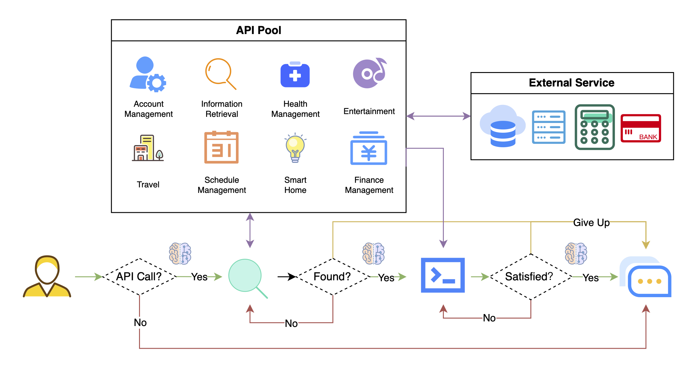
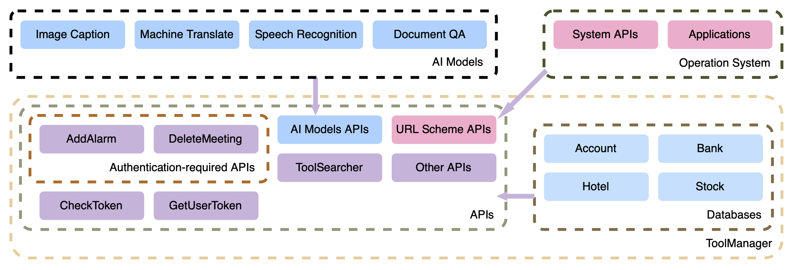

# API-Bank: A Benchmark for Tool-Augmented LLMs
Minghao Li, Feifan Song, Bowen Yu, Haiyang Yu, Zhoujun Li, Fei Huang, Yongbin Li

arXiv: [[Abstract]](https://arxiv.org/abs/2304.08244)/[[PDF]](https://arxiv.org/pdf/2304.08244.pdf)
<!-- PDF: [API-Bank-arxiv-version.pdf](API-Bank-arxiv-version.pdf)
 -->
 
## Abstract

Recent research has shown that Large Language Models (LLMs) can utilize external tools to improve their contextual processing abilities, moving away from the pure language modeling paradigm and paving the way for Artificial General Intelligence. Despite this, there has been a lack of systematic evaluation to demonstrate the efficacy of LLMs using tools to respond to human instructions. This paper presents API-Bank, the first benchmark tailored for Tool-Augmented LLMs. API-Bank includes 53 commonly used API tools, a complete Tool-Augmented LLM workflow, and 264 annotated dialogues that encompass a total of 568 API calls. These resources have been designed to thoroughly evaluate LLMs' ability to plan step-by-step API calls, retrieve relevant APIs, and correctly execute API calls to meet human needs. The experimental results show that GPT-3.5 emerges the ability to use the tools relative to GPT3, while GPT-4 has stronger planning performance. Nevertheless, there remains considerable scope for further improvement when compared to human performance. Additionally, detailed error analysis and case studies demonstrate the feasibility of Tool-Augmented LLMs for daily use, as well as the primary challenges that future research needs to address.

## Tool-Augmented LLMs Paradigm



## System Design



## Citation

```
@misc{li2023apibank,
      title={API-Bank: A Benchmark for Tool-Augmented LLMs}, 
      author={Minghao Li and Feifan Song and Bowen Yu and Haiyang Yu and Zhoujun Li and Fei Huang and Yongbin Li},
      year={2023},
      eprint={2304.08244},
      archivePrefix={arXiv},
      primaryClass={cs.CL}
}
```
