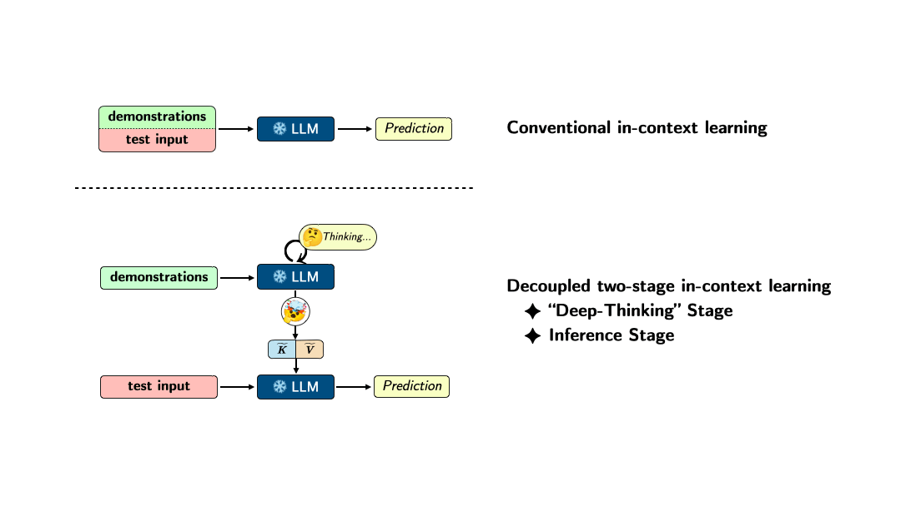
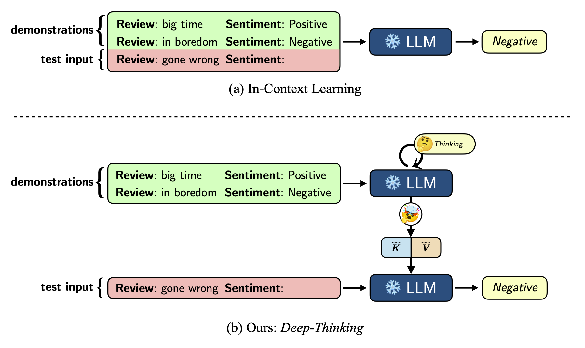

# Iterative Forward Tuning Boosts In-context Learning in Language Models

## Links 🤔

- **Paper**
  - [ArXiv](https://arxiv.org/pdf/2305.13016.pdf)
- **Code**
  - [GitHub](https://github.com/AlibabaResearch/DAMO-ConvAI/tree/main/deep-thinking)
- **Demos**
  - [HuggingFace Gradio Space](https://huggingface.co/spaces/huybery/deep-thinking)
  - [ModelScope / 魔搭](https://modelscope.cn/studios/huybery/deep-thinking/summary)


<style>
img{max-width: 80%; margin: 0 auto; display: block;}
</style>

<!--  -->



## Overview 🤔

The single-turn ICL of LLM is incoordinate with the decision making process of humans by learning from analogy. In this work, we propose an effective and efficient **two-stage framework** to boost ICL. We divide the ICL process into ***Deep-Thinking*** and inference stages. 

The ***Deep-Thinking*** stage performs iterative forward optimization of demonstrations, which is expected to boost the reasoning abilities of LLMs at test time. It produces accumulated meta-gradients by manipulating the Key-Value matrices in the self-attention modules of the Transformer. 

Then, the inference stage only takes the test query as input without concatenating demonstrations and applies the learned meta-gradients through attention for output prediction. In this way, demonstrations are not required during the inference stage since they are already learned and stored in the definitive meta-gradients. 

LLMs can be effectively and efficiently adapted to downstream tasks. Extensive experiments on ten classification and multiple-choice datasets show that our method achieves substantially better performance than standard ICL in terms of both accuracy and efficiency.


## Requirements 🤔

All experiments are conducted on **a single NVIDIA A100 (80G) GPU**. 

1. If you want *8-bit inference* **disabled**

```plain text
torch                  1.10.1+cu111
transformers           4.26.1
datasets
```

2. If you want *8-bit inference* **enabled**

```plain text
accelerate             0.18.0
bitsandbytes           0.38.1
torch                  1.10.1+cu111
transformers           4.26.1
datasets
```

**Note**: The versions of the Python packages listed above are not mandatory. We provide specific versions because our experiments are conducted on those versions. Additionally, you may encounter version conflicts or others issues when running experiments (especially for packages `transformers` and `bitsandbytes`), which may require manual debugging to find the most suitable version.

## Get started 🤔

If you already have `HuggingFace` cached models, head to `anchor.py` and modify `checkpoints_root`.

The main file: **`task_logprob_main.py`**.

We provide two ways to run experiments:

1. Run in **debug** model

Edit `task_logprob_main.py`, set `DEBUG = True`

```python
# ...
if __name__ == "__main__":
    DEBUG = True # <---
    # ...
```

Modify whatever you want, and type `python task_logprob_main.py` to run.


2. Run all experiments in one command-line.

```bash
# There are 4 options for each sh file: SEED, NUM_K, IN_8BIT, GPU_IDX
# And we set SEED=0, NUM_K=1, IN_8BIT=true

# To disable 8bit inference, set `IN_8BIT` to `false`.

# run_main_{name}.sh  SEED  NUM_K  IN_8BIT  GPU_IDX
bash scripts/run_main_agnews.sh 0 1 true 0
bash scripts/run_main_sst2.sh 0 1 true 0
bash scripts/run_main_trec.sh 0 1 true 0
bash scripts/run_main_qasc.sh 0 1 true 0
# ...
# See ./scripts for more datasets.
```


## We need your help! 🤔

There are still many questions and new discoveries worth exploring. We invite interested readers to join us in uncovering the potential of this method.

1. Can the momentum-based **meta-optimizer** be replaced by more advanced methods?
2. Are there better estimation methods for **pseudo-gradients**?
3. How can we determine **forward tuning steps** earlier?
4. In which **other tasks** can this iterative method be applied?
5. Can this iterative method be used to overcome persistent **difficulties in other areas**?

## Citation 🤔

If you finding our work interesting or helpful to you, please cite this repo 😘.

```plain
@article{yang2023iterative,
  title={Iterative Forward Tuning Boosts In-context Learning in Language Models},
  author={Yang, Jiaxi and Hui, Binyuan and Yang, Min and Li, Binhua and Huang, Fei and Li, Yongbin},
  journal={arXiv preprint arXiv:2305.13016},
  year={2023}
}
```
