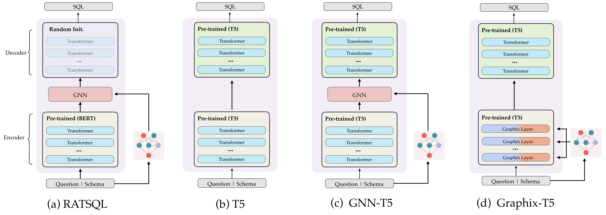
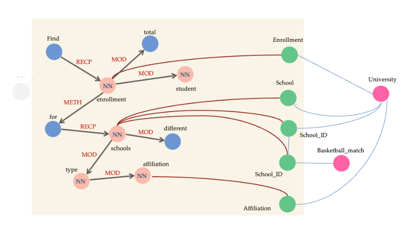
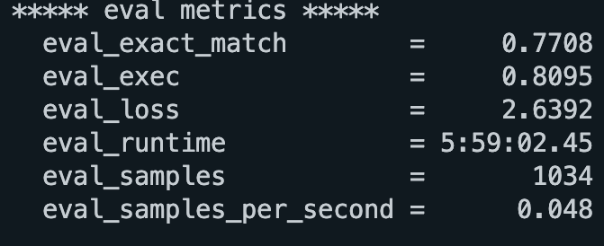

# Graphix-T5: Mixing Pre-Trained Transformers with Graph-Aware Layers for Text-to-SQL Parsing

[](https://bird-bench.github.io/)
[](https://www.python.org/downloads/release/python-390/)
[](https://pytorch.org/blog/pytorch-1.8-released/)
[](https://yale-lily.github.io/spider)

[]() Please check out our recent work [`BIRD-SQL`](https://bird-bench.github.io/), a monster corss-domain text-to-SQL benchmark. This would be a channel towards of your parser in the real-world scenarios.


<p align="center" width="100%">
<a></a>
</p>

## Overview

Graphix-T5 is a graph-aware semi-pretrained text-to-text PLM specifically designed to improve multi-hop reasoning for the complex text-to-SQL task. This novel architecture enhances the structural encoding capabilities of the T5 model while preserving its powerful contextual encoding ability. The experimental results demonstrate the effectiveness of GRAPHIX-T5 and underscore the importance of incorporating structural information in text-to-text PLMs for tackling intricate text-to-SQL challenges. The smaller gap of performance between dev and test sets indicate stronger generalization capability of Graphix-T5.

## Hands-on Implementation
In Graphix, we adopt docker to set up environment and experiments since it's more protable.

### Environment Setup:
• Please pull our images through
```bash
$ docker pull eyuansu62/graphix-text-to-sql:v2
```
• Also, clone the recursive packages:

```bash
$ git submodule update --init --recursive
```
### Pre-processing:
• The dependency packages are complex but very effective. so before beginning, you should download our pre_processed dependency packages [`dependency.zip`](https://drive.google.com/uc?export=download&id=15xk4O33THkpLQthTMN508Ye3oSQhH3iM). Unzip and put these dependencies to data_all_in/preprocess/. It cantains `stanza_resources`, `ptb.baffine.dep.lstm.char`, `ptb.baffine.dep.lstm.char.zip`, `ptb.baffine.dependency.lstm.char.zip`. The `default.zip` should be set under [`data_all_in/`](./data_all_in/) This is the fast way to set up dependency environment, or you could refer to [`Supar`](https://pypi.org/project/supar/) to install them by simply `pip`. However, the downloading speed would be limited in some zone.
• Supar is a reliable dependency parsing package, which implements many classic models from Stanford, like biaffine. We manually parsd 100 complex questions in SPIDER and BIRD, and found that this is the most reliable package even than other official implementation packages. The number of dep (unclear relations) is very small.

<p align="center" width="100%">
<a></a>
</p>

• Please download t5-large into [`data_all_in/t5-large`](./data_all_in/t5-large/) to pre-tokenize the input for graph construction. \
• Please download and store [`SPIDER`](https://yale-lily.github.io/spider) data to [`data_all_in/data/spider`](./data_all_in/data/spider/).

Preprocess the original text-to-sql data to Graphix-readable data:
```bash
$ make pre_process
```
• All data will be stored in [`data_all_in/data/output`](./data_all_in/data/output) The core data names are :
`seq2seq_train_dataset.json`, `seq2seq_dev_dataset.json`, `graph_pedia_total.bin`. Graph pedia stores all graph objects for both train and dev examples.

• Or you could download our processed data [`spider_graph`](https://drive.google.com/uc?export=download&id=19PD1kX23zk5vBQb_oR4tfNa6Kc27wUkt). And put `train_syntax.json` and `dev_syntax.json` into [`data_all_in/data/`](./data_all_in/data/). Then put all data under [`data_all_in/data/output/`](./data_all_in/data/output/).

### Start Training:
• The training hyper-parameters can be tuned in [`configs/train.json`](./configs/train.json).
• Please train your model by:
```bash
$ make train
```

### Evaluation:
• For PICARD mode, you should visit [`configs/eval.json`](./configs/eval.json) and set `use_picard=true`.
```bash
$ make eval
```
• Graphix-3B + PICARD achieved state-of-the-art performance on the SPIDER leaderboard. We made our checkpoint available on Hugging Face at the following link: https://huggingface.co/patrickNLP/Graphix-3B. Our reproduced performance under an A100 80G is:

<p align="center" width="100%">
<a></a>
</p>

• The detailed steps are:
```bash
cd ./train_db_id/
git lfs install
git clone https://huggingface.co/patrickNLP/Graphix-3B
```
• Finally set `"model_name_or_path": "/train_db_id/Graphix-3B"` in the [`configs/eval.json`](./configs/eval.json) to evaluate.

## Future Work:
We have incorporated Picard as a post-processing step for SQL queries to enhance Graphix-T5's awareness of database contents. However, Picard was specifically designed for SPIDER-based grammars, making it unsuitable for other datasets with different SQL syntax, such as BIRD, GeoQuery, etc. In the future, we plan to explore alternative strategies to improve Graphix-T5's performance, such as integrating NatSQL and LLM to better leverage database contents. Additionally, flattening all database items may result in the loss of important items when truncating large database schemas. In this work, we attempted with a training-free sampling strategy to retrieve a list of candidate database items for SQL generation, rather than feeding all database schemas as baselines. We aim to optimize it and present this approach in the BIRD evaluation in future work.


## Acknowledgement

We thank Dr. Tao Yu and Tianbao Xie for evaluation of our work on SPIDER leaderboard. We thank Dr. Bailin Wang and Dr. Bowen Li for constructive suggestions. We thank all anonymous reviewers for their comments.

## Citation

Please cite the repo if you think our work is helpful to you.

```
@misc{li2023graphixt5,
      title={Graphix-T5: Mixing Pre-Trained Transformers with Graph-Aware Layers for Text-to-SQL Parsing}, 
      author={Jinyang Li and Binyuan Hui and Reynold Cheng and Bowen Qin and Chenhao Ma and Nan Huo and Fei Huang and Wenyu Du and Luo Si and Yongbin Li},
      year={2023},
      eprint={2301.07507},
      archivePrefix={arXiv},
      primaryClass={cs.CL}
}
```