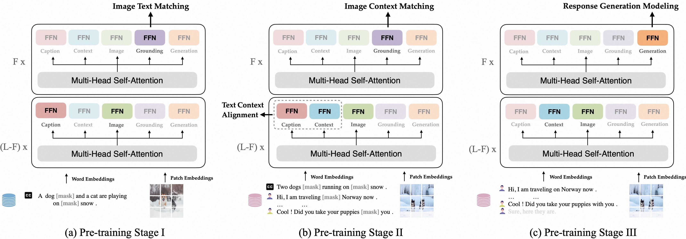

# PaCE: Unified Multi-modal Dialogue Pre-training with Progressive and Compositional Experts

## 🔥 Updates
- [**2023-05-02**]: PaCE was accepted by ACL 2023

## 🏴󠁶󠁵󠁭󠁡󠁰󠁿 Overview
PaCE, a unified, structured, compositional multi-modal dialogue pre-training framework. It utilizes a combination of several fundamental experts to accommodate multiple dialogue-related tasks and can
be pre-trained using limited dialogue and extensive non-dialogue multi-modal data. Furthermore, we propose a progressive training method where old experts from the past can assist new experts, facilitating the expansion of their capabilities. 
<center class="third">
    
</center>

## ⚡️ Quickstart

### Prepare Environment

First, you should set up a python environment. This code base has been tested under python 3.x, and we officially support python 3.7.

```bash
$ conda create -n pace python=3.7
$ cd PaCE # where contains 'requirements.txt'
$ pip install -r requirements.txt
```
### Pre-trained model

The pretrained models of PaCE can be found at [here](https://drive.google.com/file/d/1bqryeixfEjsrv3iLe0uYQ6cRGq8XoXmt/view?usp=share_link)

### Finetuning
```bash
$ python run.py with env_8 task_finetune_irtr_photochat_randaug per_gpu_batchsize=4 load_path=[pretrained.ckpt] data_root=[datasets] log_dir=[log_dir]
```
### Evaluation
```bash
$ python run.py with env_debug task_finetune_irtr_photochat_randaug per_gpu_batchsize=4 test_only=True precision=32 load_path=[pretrained.ckpt] data_root=[datasets] log_dir=[log_dir]
```

## 💿 Resource

### Corpus

We do not distribute datasets because of the license issue. Please download the datasets by yourself. We placed links for each dataset below for downloading. And we process data to the same format as in [ViLT](https://github.com/microsoft/unilm/blob/master/vlmo/DATA.md).


<table style="margin: auto">
  <tr>
    <th>Multi-Modal Non-Dialogue Data</th>
    <th><a href="http://visualgenome.org/api/v0/api_home.html" style="color:blue">VG</a></th>
    <th><a href="https://www.cs.rice.edu/~vo9/sbucaptions/" style="color:purple">SBU</a></th>
    <th><a href="https://cocodataset.org/#download" style="color:green">MSCOCO</a></th>
    <th><a href="https://github.com/google-research-datasets/conceptual-captions" style="color:LightBlue">GCC</a></th>
    <th>-</th>
    <th>-</th>
  </tr>
  <tr>
    <th>Multi-Modal Dialogue Data</th>
    <th><a href="https://visualdialog.org" style="color:blue">VisDial</a></th>
    <th><a href="https://parl.ai/projects/image_chat/" style="color:purple">ImageChat</a></th>
    <th><a href="https://github.com/victorsungo/MMDialog" style="color:green">MMDialog</a></th>
    <th><a href="https://github.com/liziliao/MMConv" style="color:LightBlue">MMConv</a></th>
    <th><a href="https://github.com/facebookresearch/simmc2/tree/simmc2.0" style="color:orange">SIMMC 2.0</a></th>
    <th><a href="https://github.com/google-research/google-research/tree/master/multimodalchat/photochat" style="color:purple">Photochat</span></th>
  </tr>
</table>


## Project
- For `pace`, there is an overview:

```shell
|-- datamodules
    |-- vocabs # Contain specialized vocabulary required for downstream datasets.
    |-- datamodule_base.py # Define the high-level interface for the dataset.
    |-- photochat_datamodule.py 
    |-- ... # Datamodule for each dataset.
|-- datasets
    |-- base_dataset.py # Specify the specifics of acquiring individual items and transforming them into batches.
    |-- photochat_dataset.py # Define dataset-specific functions.
    |-- ... # For each 'dataset'.
|-- gadgets
    |-- metrics.py # Define evaluation metrics
|-- modules
        |-- heads.py # Define model head(like MLMHead). 
    |-- objectives.py # Compute loss for various tasks.
    |-- vision_transformer.py # ViT model
    |-- pace_module.py # Model architecture
    |-- pace_utils.py # Set metrics and schedule / wrapup epoch
|-- tranforms # Transforms on images, i.e. resize, randaug and so on. 
|-- utils # This mainly defines functions related to converting data processing to array format, as well as some helpful functions.
        |-- write_photochat.py 
        |-- ...
        |-- format_simmc_dst_generation.py
        |-- ...
|-- config.py # Config your global settings, such as numbers of your GPU, output directory, and the location of your dataset, and so on.  Furthermore, you can configure different hyperparameters for different tasks here.

```

## 💬 Citation
@article{li2023pace,
  title={PaCE: Unified Multi-modal Dialogue Pre-training with Progressive and Compositional Experts},
  author={Li, Yunshui and Hui, Binyuan and Yin, ZhiChao and Yang, Min and Huang, Fei and Li, Yongbin},
  journal={arXiv preprint arXiv:2305.14839},
  year={2023}
}
## 👍 Acknowledge

This repository is built using the [ViLT](https://github.com/dandelin/ViLT) repository and the [timm](https://github.com/rwightman/pytorch-image-models) library.. 

## 📝 License

Please note that there are **TWO LICENSES** for code and pre-training corpus.
The code and pre-trained models are open-sourced under [MIT License](LICENSE-Code), while the pre-training corpus is released under [CC BY-SA 4.0](LICENSE-Data).