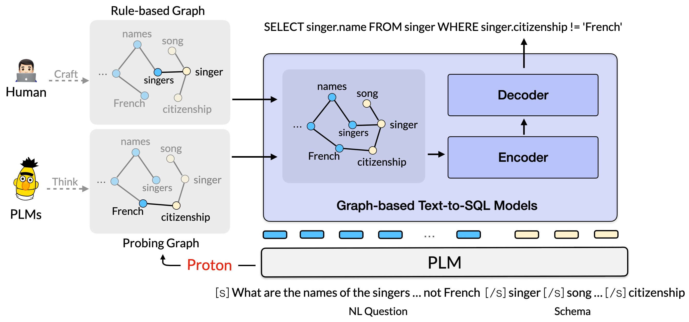

# Proton: Probing Schema Linking Information from Pre-trained Language Models for Text-to-SQL Parsing

This repository contains code for the KDD 2022 paper [Proton: Probing Schema Linking Information from Pre-trained Language Models for Text-to-SQL Parsing](https://arxiv.org/abs/2206.14017).

If you use Proton in your work, please cite it as follows:

```
@inproceedings{wang2022proton,
    title={Proton: Probing Schema Linking Information from Pre-trained Language Models for Text-to-SQL Parsing},
    author={Wang, Lihan and Qin, Bowen and Hui, Binyuan and Li, Bowen and Yang, Min and Wang, Bailin and Li, Binhua and Huang, Fei and Si, Luo and Li, Yongbin},
    booktitle={KDD},
    year={2022}
}
```

## Overview

In this work, we propose a novel framework, called **Proton**, which first probes the underlying relational schema-linking structures between a NL query and its database schema from a pre-trained language model, and then effectively injects it into the downstream text-to-SQL parsing models.



## Codebase

### Prepare Environment

The setup of the environment is exactly the same as that of [LGESQL](https://github.com/rhythmcao/text2sql-lgesql):

The environment-related commands are provided in `setup.sh`.

```bash
sh setup.sh
```

### Download dataset.

Download, unzip and rename the [spider.zip](https://drive.google.com/uc?export=download&id=1_AckYkinAnhqmRQtGsQgUKAnTHxxX5J0) into the directory `data`. Merge the `data/train_spider.json` and `data/train_others.json` into one single dataset `data/train.json`.

### Preprocess dataset.

Preprocess the train and dev dataset, including input normalization, schema linking, graph construction and output actions generation.

```bash
./run/run_preprocessing.sh
```

### Training

Training  Proton with:

```
./run/run_lgesql_plm.sh msde electra-large-discriminator
```

### Evaluation

For evaluation, see `run/run_evaluation.sh` and `run/run_submission.sh` (eval from scratch) for reference.

## Result

| Model           | DK   | SYN  | Spider |
| --------------- | ---- | ---- | ------ |
| LGESQL          | 48.4 | 64.6 | 75.3   |
| LGESQL + Proton | 51.0 | 65.6 | 76.3   |

## Acknowledgements

This implementation is based on [RAT-SQL: Relation-Aware Schema Encoding and Linking for Text-to-SQL Parsers.](https://github.com/microsoft/rat-sql) and [LGESQL: Line Graph Enhanced Text-to-SQL Model with Mixed Local and Non-Local Relations](https://github.com/rhythmcao/text2sql-lgesql). Thanks to the author for releasing the code.
