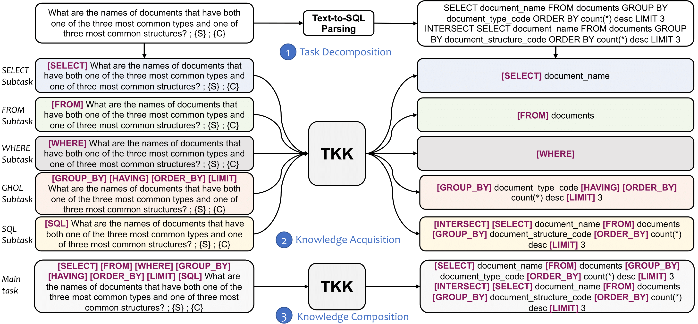

# Towards Generalizable and Robust Text-to-SQL Parsing


Code for paper [Towards Generalizable and Robust Text-to-SQL Parsing](https://arxiv.org/abs/2210.12674) (Findings of EMNLP 2022).



Text-to-SQL parsing tackles the problem of mapping natural language questions to executable SQL queries. In practice, text-to-SQL parsers often encounter various challenging scenarios, requiring them to be generalizable and robust. While most existing work addresses a particular generalization or robustness challenge, we aim to study it in a more comprehensive manner. In specific, we believe that text-to-SQL parsers should be (1) **generalizable** at three levels of generalization, namely *i.i.d.*, *zero-shot*, and *compositional*, and (2) **robust** against input perturbations. To enhance these capabilities of the parser, we propose a novel **TKK** framework consisting of **T**ask decomposition, **K**nowledge acquisition, and **K**nowledge composition to learn text-to-SQL parsing in stages. By dividing the learning process into multiple stages, our framework improves the parser's ability to acquire general SQL knowledge instead of capturing spurious patterns, making it more generalizable and robust. Experimental results under various generalization and robustness settings show that our framework is effective in all scenarios and achieves state-of-the-art performance on the Spider, SParC, and CoSQL datasets.


## Prepare the environment

Please run the following commands:

``````
conda env create -f TKK.yaml
conda activate TKK
sh data_and_cache.sh
python download.py
``````
Most of the experiments are done on NVIDIA Tesla A100 80G.

## Train and evaluate the model in the zero-shot, compositional, or iid generalization setting

``````
sh {dataset_name}_{model_size}.sh
``````
Choose the dataset name from
* spider, sparc, cosql (for zero-shot generalization)
* spider_template, spider_tmcd, spider_length (for compositional generalization)
* spider_iid, sparc_iid, cosql_iid (for i.i.d. generalization)

and model size from 
* base
* large
* 3b

In the **knowledge acquisition** stage, we train the model with multiple subtasks.
In the **knowledge composition** stage, we initialize the model with the weights of the model trained in the knowledge acquisition stage
and train the model with the main task.

## Evaluate the model in the robustness setting

Please run the following command:

``````
sh {dataset}_{model_size}_main.sh CHECKPOINT_PATH
``````
Choose the dataset name from
* spider_syn
* spider_realistic

and model size from 
* base
* large
* 3b

CHECKPOINT_PATH is the path to the checkpoint trained on Spider.


## Acknowledgement

This implementation is based on the code of [UnifiedSKG](https://github.com/HKUNLP/UnifiedSKG). Thanks for their contributions.
